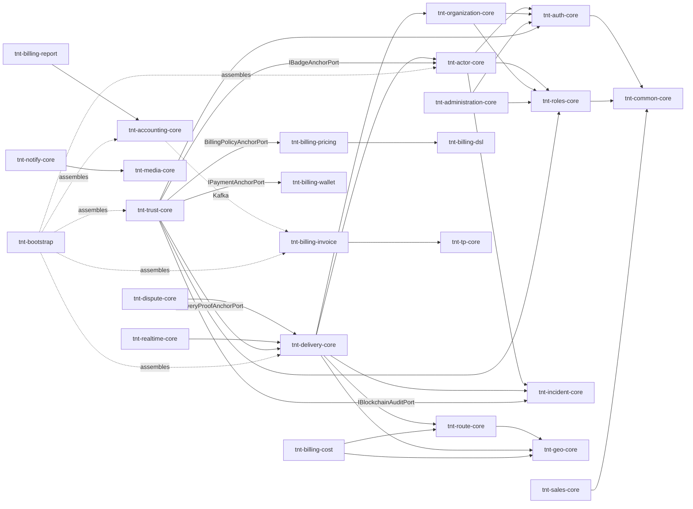

# Purpose
Visual + tabular map of which TiiBnTick module depends on which — for impact analysis ("if I change X, what could break?") and for understanding build order.

# Summary
- Build order = dependency order (root `pom.xml` `<modules>` list, L0→L7).
- Almost every module depends on `tnt-common-core` (shared types) — omitted from the diagram below for readability.
- Kernel (`yowyob.comops.api:RT-comops-*`) dependencies are read-only/external — see `architecture/overview.md` for the boundary rule.
- `tnt-trust-core` (L6, `trust/`) is the one module that depends on modules across several other layers (L2 actor, L3 delivery/incident, L5 billing-pricing/billing-wallet so far) — always one-directionally, always down into whichever module owns the port it implements. No calling module ever depends back on trust. See `architecture/modules.md` for why this puts trust above L5, not in L3 logistics where it physically used to live.

# Details

## Mermaid — key inter-module dependencies (TNT → TNT only, `tnt-common-core` omitted)

## Module → Kernel dependency table

| Module | Kernel artifacts depended on |
|---|---|
| tnt-common-core | `RT-comops-common-core`, `RT-comops-kernel-core` |
| tnt-auth-core | `RT-comops-auth-core` |
| tnt-roles-core | `RT-comops-roles-core`, `RT-comops-kernel-core` |
| tnt-actor-core | `RT-comops-actor-core`, `RT-comops-common-core`, `RT-comops-kernel-core` |
| tnt-organization-core | `RT-comops-organization-core` |
| tnt-tp-core | `RT-comops-tp-core` |
| tnt-administration-core | `RT-comops-administration-core` |
| tnt-delivery-core | `RT-comops-common-core`, `RT-comops-kernel-core` |
| tnt-resource-core | `RT-comops-resource-core` |
| tnt-product-core | `RT-comops-product-core` |
| tnt-inventory-core | `RT-comops-inventory-core` |
| tnt-sales-core | `RT-comops-sales-core` |
| tnt-accounting-core | `RT-comops-accounting-core` |
| tnt-billing-pricing | `RT-comops-accounting-core`, `RT-comops-settings-core` |
| tnt-billing-invoice | `RT-comops-common-core`, `RT-comops-settings-core` |

`RT-comops-kernel-core` is the one Kernel artifact that pulled in a conflicting transitive `swagger-annotations`/`swagger-models` (non-jakarta, v2.2.22) — now excluded at the root `pom.xml` `dependencyManagement` level. See `knowledge/known-issues.md`.

## Cross-module port-based integration points

| Caller → Callee | Port | Purpose |
|---|---|---|
| tnt-delivery-core → tnt-route-core | `EtaComputationPort` | ETA forecast |
| tnt-delivery-core → tnt-billing-cost | `DeliveryCostComputationPort` | Cost estimation on assignment |
| tnt-delivery-core ← tnt-incident-core | event: `DeliveryPausedByIncidentEvent` | Pause/resume delivery on incident |
| tnt-route-core → tnt-geo-core | `IRoadNetworkProvider` | Road graph queries |
| tnt-realtime-core → tnt-route-core | `IKalmanEtaUpdater` | Live ETA broadcast |
| tnt-realtime-core → tnt-actor-core | `IActorLocationUpdater` | GPS position persistence |
| tnt-incident-core → tnt-media-core | `IMediaStoragePort` | Evidence archival (MinIO) — see `knowledge/known-issues.md` for the tenant-bucket fix |
| all modules → tnt-notify-core | `IPublishNotificationEventPort` | Event-driven notifications |
| tnt-roles-core → Kernel (HTTP) | `kernelWebClient` | Role provisioning, permission resolution (REMOTE/HYBRID mode) |
| tnt-delivery-core → tnt-trust-core | `DeliveryProofAnchorPort` | Blockchain-anchor delivery proof on completion. Port owned by delivery, implemented in trust — Maven dependency is inverted (`trust → delivery`), never `delivery → trust` |
| tnt-incident-core → tnt-trust-core | `IBlockchainAuditPort` | Incident-chain blockchain anchoring. Port owned by incident, implemented in trust — Maven dependency inverted, same as above |
| tnt-billing-pricing → tnt-trust-core | `BillingPolicyAnchorPort` | Anchor billing policy activation on-chain. Port owned by billing-pricing, implemented in trust — Maven dependency inverted |
| tnt-billing-wallet → tnt-trust-core | `IPaymentAnchorPort` | Anchor committed wallet payments on-chain. Port owned by billing-wallet, implemented in trust — Maven dependency inverted |
| tnt-actor-core → tnt-trust-core | `IBadgeAnchorPort` | Anchor earned badges on-chain, returns tx hash persisted back onto `Badge.blockchainTxHash`. Port owned by actor-core, implemented in trust — Maven dependency inverted |

## `tnt-bootstrap` assembly
`tnt-bootstrap`'s `TntCoreConfig` `@Import`s every module's `@Configuration` class — see `architecture/modules.md` for the full module list and `infrastructure/monitoring.md` for the custom actuator endpoints that expose this wiring at runtime (`/actuator/tnt-modules`).

# Links
- `architecture/modules.md` — module table
- `architecture/overview.md` — layered build diagram
- `knowledge/known-issues.md` — Kernel dependency exclusion incident

---
> **Comment maintenir ce document** : à chaque nouvelle dépendance inter-module (un module important une interface/port d'un autre), ajouter une ligne au tableau "Cross-module port-based integration points". Régénérer le diagramme Mermaid si la topologie change significativement (nouveau module, dépendance supprimée).
