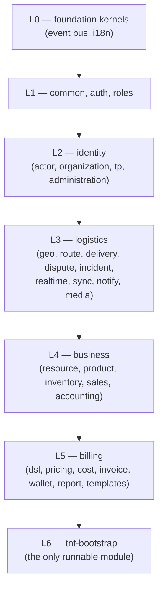
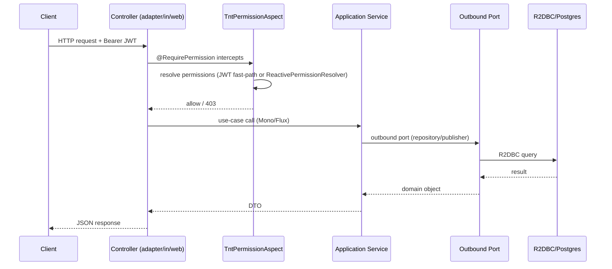

# Purpose
30-second mental model of TiiBnTick Core: what it is, how it's built, how it's deployed.

# Summary
- **What**: shared library platform for a logistics + billing system (TiiBnTick), built on top of an external "Yowyob Kernel" (RT-comops) which owns auth, base entities, RBAC persistence, file storage.
- **How**: 31 Maven modules, hexagonal architecture per module, fully reactive (WebFlux + R2DBC), event-driven via Kafka, multi-tenant.
- **Runs as**: ONE Spring Boot app (`tnt-bootstrap`) — everything else is a library JAR.

# Details

## The one-sentence pitch
A reactive, multi-tenant, hexagonal-architecture logistics platform (delivery, dispatch, incidents, disputes, real-time tracking) with an integrated billing/invoicing/wallet engine, assembled from 30 independently-versioned library modules into a single deployable Spring Boot application.

## Layered build (L0→L6) — see `architecture/modules.md` for the full table

Each layer only depends on layers above it — `pom.xml` `<modules>` order **is** the build/dependency order.

## The Yowyob Kernel boundary
Everything under groupId `yowyob.comops.api` (`RT-comops-*`) is an **external, read-only** dependency from a different team/repo. TiiBnTick Core consumes it for: base entities, `TenantId`, `Money`, JWT/auth primitives, RBAC persistence, kernel domain events, file storage SPI. **Never modify, vendor, or expect to find Kernel sources in this repo.**

## Request lifecycle (typical)

## Why this matters for future work
- Adding a feature almost always means: 1 new use-case method, 1 new port (if new persistence/external need), 1 new adapter, wired in the module's `@Configuration` — see `development/conventions.md`.
- Cross-module calls go through **ports**, never direct class imports across module boundaries (except shared `tnt-common-core` types).
- Everything reactive — `Mono`/`Flux` end-to-end, no blocking calls except Liquibase migrations (JDBC, isolated).

# Links
- `architecture/modules.md` — full module table
- `architecture/dependencies.md` — Mermaid dependency graph
- `architecture/packages.md` — hexagonal package layout
- `security/authorization.md` — `@RequirePermission` flow in detail
- `_quick-start.md` — how to run this locally

---
> **Comment maintenir ce document** : ce document doit rester stable — ne le modifier que si l'architecture globale change (nouvelle couche, changement de paradigme reactive→non-reactive, etc.). Les détails par module vont dans `modules.md`, pas ici.
