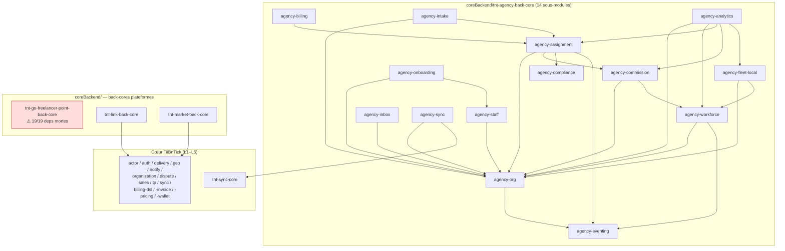

# Audit n°2 — Connexions inter-modules

**Projet :** TiiBnTick Core (`tiibntick-core`)
**Date :** 2026-07-17
**Périmètre :** les 52 modules Maven feuilles du réacteur (`pom.xml` racine, lignes 65–141), y compris le groupe `coreBackend/` (lignes 132–135 : `tnt-agency-back-core` et ses 14 sous-modules, `tnt-go-freelancer-point-back-core`, `tnt-link-back-core`, `tnt-market-back-core`).
**Méthode :** parsing XML de tous les `pom.xml` (dépendances `com.yowyob.tiibntick.core:*`) ; calcul du préfixe de package Java de chaque module (aucune collision détectée) ; recherche exhaustive de chaque préfixe dans `src/main/java`, `src/test/java` et `src/main/resources` de chaque autre module pour établir le graphe **effectif** (usages réels) et le confronter au graphe **déclaré** ; détection de cycles (Tarjan) ; inspection manuelle de chaque anomalie avant publication (zéro affirmation sans preuve fichier:ligne).

---

## 1. Résumé exécutif

Le graphe Maven est **acyclique**, entièrement épinglé dans le `dependencyManagement` racine, et le pattern « port possédé par l'appelant / adaptateur dans `tnt-trust-core` » est correctement câblé (10/10 dépendances de trust réellement utilisées). En revanche :

- **50 % du graphe déclaré est mort** : sur 223 arêtes inter-modules déclarées (hors `tnt-bootstrap`), **112 ne correspondent à aucun usage** dans le code (ni main, ni test, ni ressources). Le graphe Maven ne décrit plus l'architecture réelle.
- **2 violations de la règle de layering** (jamais dépendre d'une couche strictement supérieure) : `tnt-actor-core` (L2) → `tnt-incident-core` (L3), utilisée dans le code avec un pattern de port **inversé** par rapport à la règle documentée dans CLAUDE.md ; et `yow-i18n-kernel` (L0) → `tnt-common-core` (L1), déclarée mais inutilisée.
- **`yow-event-kernel` est un module fantôme** : 60 classes, 21 consommateurs Maven déclarés, **zéro import réel dans tout le dépôt**.
- L'assemblage réel de l'application repose sur un **`@ComponentScan` global** (`com.yowyob.tiibntick`) et non sur les `@Import` par module décrits par CLAUDE.md — c'est ce qui masque les dépendances mortes et rend le graphe Maven non contraignant à l'exécution.
- Le groupe **`coreBackend/` (17 modules, ~1/3 du réacteur) est absent du modèle de couches L0–L7 documenté** ; les 14 modules `tnt-agency-*` déclarent tous `tnt-auth-core`/`tnt-roles-core` sans jamais utiliser `@RequirePermission` ni `TntSecurityContext`.

Aucune dépendance implicite (usage sans déclaration Maven) n'a été trouvée : l'unique candidat détecté est un commentaire volontaire et documenté (voir §4, point positif n°6).

---

## 2. Cartographie complète des dépendances

### 2.1 Attribution des couches

| Couche | Modules |
|---|---|
| **L0** | `yow-event-kernel`, `yow-i18n-kernel` |
| **L1** | `tnt-common-core`, `tnt-auth-core`, `tnt-roles-core`, `tnt-platform-gateway-core` |
| **L2** | `tnt-actor-core`, `tnt-organization-core`, `tnt-tp-core`, `tnt-administration-core` |
| **L3** | `tnt-geo-core`, `tnt-route-core`, `tnt-delivery-core`, `tnt-dispute-core`, `tnt-incident-core`, `tnt-realtime-core`, `tnt-sync-core`, `tnt-notify-core`, `tnt-media-core` |
| **L4** | `tnt-resource-core`, `tnt-product-core`, `tnt-inventory-core`, `tnt-sales-core`, `tnt-accounting-core`, `tnt-hrm-core` (†) |
| **L5** | `tnt-billing-dsl`, `tnt-billing-pricing`, `tnt-billing-cost`, `tnt-billing-invoice`, `tnt-billing-wallet`, `tnt-billing-report`, `tnt-billing-templates` |
| **L6** | `tnt-trust-core` |
| **L6-bis (†, non documentée)** | `coreBackend/` : 14 modules `tnt-agency-*` + `tnt-go-freelancer-point-back-core` + `tnt-link-back-core` + `tnt-market-back-core` |
| **L7** | `tnt-bootstrap` |

(†) `tnt-hrm-core` et l'intégralité de `coreBackend/` n'apparaissent pas dans le tableau des couches de `CLAUDE.md`. Les couches attribuées ici sont déduites de leur position dans le `pom.xml` racine (déclarés entre `trust/` et `tnt-bootstrap`, lignes 132–135) et de leurs dépendances effectives (ils consomment L1–L5 et personne ne dépend d'eux sauf `tnt-bootstrap` — ce sont bien des feuilles consommatrices, ce qui est cohérent).

### 2.2 Matrice exhaustive module → dépendances (déclarées, annotées par usage réel)

Colonne « Utilisées » : au moins une référence au package du module cible dans les sources. Colonne « Mortes » : déclarée dans le `pom.xml`, **zéro** référence (main + test + ressources).

| Module | Dépendances utilisées | Dépendances mortes |
|---|---|---|
| `yow-event-kernel` | — | — |
| `yow-i18n-kernel` | — | tnt-common-core ⚠️(violation L0→L1) |
| `tnt-common-core` | — | — |
| `tnt-auth-core` | tnt-common-core, tnt-roles-core | — |
| `tnt-roles-core` | tnt-common-core | — |
| `tnt-platform-gateway-core` | tnt-auth-core, tnt-common-core, tnt-roles-core | — |
| `tnt-actor-core` | tnt-auth-core, tnt-common-core, **tnt-incident-core** ⚠️(violation L2→L3), tnt-roles-core | yow-event-kernel |
| `tnt-organization-core` | tnt-auth-core, tnt-common-core, tnt-roles-core | tnt-actor-core, yow-event-kernel |
| `tnt-tp-core` | tnt-auth-core, tnt-common-core, tnt-roles-core | yow-event-kernel |
| `tnt-administration-core` | tnt-auth-core, tnt-common-core, tnt-organization-core, tnt-roles-core | — |
| `tnt-geo-core` | — | tnt-common-core, yow-event-kernel |
| `tnt-route-core` | tnt-geo-core, tnt-incident-core | tnt-auth-core, tnt-common-core, tnt-roles-core, yow-event-kernel |
| `tnt-delivery-core` | tnt-auth-core, tnt-incident-core, tnt-roles-core | tnt-actor-core, tnt-geo-core, tnt-organization-core, tnt-route-core, yow-event-kernel, yow-i18n-kernel |
| `tnt-dispute-core` | — | tnt-actor-core, tnt-common-core, tnt-delivery-core, tnt-notify-core, yow-event-kernel |
| `tnt-incident-core` | — | tnt-common-core |
| `tnt-realtime-core` | — | tnt-actor-core, tnt-common-core, tnt-geo-core, tnt-route-core, yow-event-kernel |
| `tnt-sync-core` | — | tnt-common-core, yow-event-kernel |
| `tnt-notify-core` | tnt-common-core, tnt-incident-core, yow-i18n-kernel | tnt-auth-core, tnt-realtime-core, tnt-roles-core, yow-event-kernel |
| `tnt-media-core` | tnt-incident-core | yow-event-kernel |
| `tnt-resource-core` | tnt-auth-core, tnt-common-core, tnt-incident-core, tnt-roles-core | yow-event-kernel |
| `tnt-product-core` | tnt-common-core | — |
| `tnt-inventory-core` | — | tnt-common-core, yow-event-kernel |
| `tnt-sales-core` | tnt-common-core | yow-event-kernel |
| `tnt-accounting-core` | tnt-common-core | yow-event-kernel |
| `tnt-hrm-core` | tnt-common-core | — |
| `tnt-billing-dsl` | — | tnt-common-core, yow-event-kernel, yow-i18n-kernel |
| `tnt-billing-pricing` | tnt-billing-dsl | yow-event-kernel |
| `tnt-billing-cost` | — (aucune dépendance interne déclarée) | — |
| `tnt-billing-invoice` | tnt-roles-core | tnt-auth-core, tnt-tp-core, yow-event-kernel |
| `tnt-billing-wallet` | tnt-incident-core, tnt-roles-core | tnt-auth-core |
| `tnt-billing-report` | tnt-billing-invoice, tnt-roles-core | tnt-auth-core, yow-event-kernel |
| `tnt-billing-templates` | — | tnt-billing-dsl, tnt-billing-pricing, tnt-common-core |
| `tnt-trust-core` | tnt-actor-core, tnt-auth-core, tnt-billing-pricing, tnt-billing-wallet, tnt-delivery-core, tnt-dispute-core, tnt-incident-core, tnt-organization-core, tnt-realtime-core, tnt-roles-core | — (10/10 utilisées ✅) |
| `tnt-agency-eventing-core` | tnt-common-core | — |
| `tnt-agency-org-core` | tnt-agency-eventing-core, tnt-common-core | tnt-auth-core, tnt-roles-core |
| `tnt-agency-staff-core` | tnt-agency-org-core, tnt-common-core | tnt-auth-core, tnt-roles-core |
| `tnt-agency-workforce-core` | tnt-agency-eventing-core, tnt-agency-org-core, tnt-common-core | tnt-agency-staff-core, tnt-auth-core, tnt-roles-core |
| `tnt-agency-assignment-core` | tnt-agency-commission-core, tnt-agency-compliance-core, tnt-agency-eventing-core, tnt-agency-org-core, tnt-common-core | tnt-auth-core, tnt-roles-core |
| `tnt-agency-commission-core` | tnt-agency-org-core, tnt-agency-workforce-core, tnt-common-core | tnt-auth-core, tnt-roles-core |
| `tnt-agency-billing-core` | tnt-agency-assignment-core, tnt-common-core | tnt-agency-org-core, tnt-auth-core, tnt-roles-core |
| `tnt-agency-onboarding-core` | tnt-agency-org-core, tnt-agency-staff-core, tnt-common-core | tnt-auth-core, tnt-roles-core |
| `tnt-agency-intake-core` | tnt-agency-assignment-core, tnt-agency-org-core, tnt-common-core | tnt-auth-core, tnt-roles-core |
| `tnt-agency-inbox-core` | tnt-agency-org-core, tnt-common-core | tnt-auth-core, tnt-roles-core |
| `tnt-agency-fleet-local-core` | tnt-agency-org-core, tnt-agency-workforce-core, tnt-common-core | tnt-auth-core, tnt-roles-core |
| `tnt-agency-compliance-core` | tnt-common-core | tnt-agency-eventing-core, tnt-auth-core, tnt-roles-core |
| `tnt-agency-analytics-core` | tnt-agency-assignment-core, tnt-agency-commission-core, tnt-agency-fleet-local-core, tnt-agency-org-core, tnt-agency-workforce-core, tnt-common-core | tnt-auth-core, tnt-roles-core |
| `tnt-agency-sync-core` | tnt-agency-org-core, tnt-common-core, tnt-sync-core | tnt-auth-core |
| `tnt-go-freelancer-point-back-core` | — | **les 19 déclarées** : tnt-actor-core, tnt-auth-core, tnt-billing-cost, tnt-billing-pricing, tnt-billing-report, tnt-billing-wallet, tnt-common-core, tnt-delivery-core, tnt-geo-core, tnt-notify-core, tnt-organization-core, tnt-platform-gateway-core, tnt-realtime-core, tnt-resource-core, tnt-roles-core, tnt-route-core, tnt-sync-core, yow-event-kernel, yow-i18n-kernel |
| `tnt-link-back-core` | tnt-actor-core, tnt-auth-core, tnt-delivery-core, tnt-geo-core, tnt-notify-core | tnt-common-core, tnt-incident-core, tnt-organization-core, tnt-realtime-core, tnt-roles-core, tnt-route-core, tnt-sync-core |
| `tnt-market-back-core` | tnt-actor-core, tnt-auth-core, tnt-billing-dsl, tnt-billing-invoice, tnt-billing-pricing, tnt-billing-wallet, tnt-delivery-core, tnt-dispute-core, tnt-geo-core, tnt-notify-core, tnt-organization-core, tnt-sales-core, tnt-sync-core, tnt-tp-core | tnt-common-core, tnt-media-core, tnt-product-core, tnt-realtime-core, tnt-roles-core |
| `tnt-bootstrap` | (module d'assemblage : ses 50 dépendances sont légitimes au runtime via component-scan, même sans référence source — voir §5.5) | — |

**Bilan chiffré : 223 arêtes déclarées (hors bootstrap), 112 mortes (50 %).**

### 2.3 Diagramme Mermaid — cœur L0 → L7 (arêtes **effectives** uniquement)

Pour la lisibilité : les arêtes omniprésentes vers `tnt-common-core`, `tnt-auth-core`, `tnt-roles-core` (utilisées par presque tous les modules) ne sont pas dessinées ; les arêtes en pointillé rouge sont les violations de couche.

```mermaid
graph TD
    subgraph L0["L0 — foundation kernels"]
        EVK[yow-event-kernel<br/>⚠️ 0 usage repo]
        I18N[yow-i18n-kernel]
    end
    subgraph L1["L1 — foundation"]
        COMMON[tnt-common-core]
        AUTH[tnt-auth-core]
        ROLES[tnt-roles-core]
        PGW[tnt-platform-gateway-core]
    end
    subgraph L2["L2 — identity"]
        ACTOR[tnt-actor-core]
        ORG[tnt-organization-core]
        TP[tnt-tp-core]
        ADMIN[tnt-administration-core]
    end
    subgraph L3["L3 — logistics"]
        GEO[tnt-geo-core]
        ROUTE[tnt-route-core]
        DELIV[tnt-delivery-core]
        DISPUTE[tnt-dispute-core]
        INCIDENT[tnt-incident-core]
        REALTIME[tnt-realtime-core]
        SYNC[tnt-sync-core]
        NOTIFY[tnt-notify-core]
        MEDIA[tnt-media-core]
    end
    subgraph L4["L4 — business"]
        RESOURCE[tnt-resource-core]
        PRODUCT[tnt-product-core]
        INVENTORY[tnt-inventory-core]
        SALES[tnt-sales-core]
        ACCOUNTING[tnt-accounting-core]
        HRM[tnt-hrm-core]
    end
    subgraph L5["L5 — billing"]
        DSL[tnt-billing-dsl]
        PRICING[tnt-billing-pricing]
        COST[tnt-billing-cost<br/>isolé]
        INVOICE[tnt-billing-invoice]
        WALLET[tnt-billing-wallet]
        REPORT[tnt-billing-report]
        TEMPLATES[tnt-billing-templates]
    end
    subgraph L6["L6 — trust"]
        TRUST[tnt-trust-core]
    end
    subgraph L7["L7"]
        BOOT[tnt-bootstrap]
    end

    I18N -. "pom seul, jamais utilisé ⚠️ L0→L1" .-> COMMON
    AUTH --> ROLES
    PGW --> AUTH
    ACTOR -. "ActorReputationPortAdapter ⚠️ L2→L3" .-> INCIDENT
    ADMIN --> ORG
    ROUTE --> GEO
    ROUTE --> INCIDENT
    DELIV --> INCIDENT
    NOTIFY --> INCIDENT
    NOTIFY --> I18N
    MEDIA --> INCIDENT
    RESOURCE --> INCIDENT
    WALLET --> INCIDENT
    PRICING --> DSL
    REPORT --> INVOICE
    TRUST --> ACTOR
    TRUST --> ORG
    TRUST --> DELIV
    TRUST --> DISPUTE
    TRUST --> INCIDENT
    TRUST --> REALTIME
    TRUST --> PRICING
    TRUST --> WALLET
    BOOT --> TRUST

    style ACTOR fill:#fdd,stroke:#c00
    style I18N fill:#fdd,stroke:#c00
    style EVK fill:#eee,stroke:#999,stroke-dasharray: 5 5
    style COST fill:#ffe9c9,stroke:#c80
```



### 2.4 Diagramme Mermaid — groupe `coreBackend/` (arêtes effectives)



Les 4 modules `coreBackend` de premier niveau sont bien des **feuilles consommatrices** : aucun module du cœur ne dépend d'eux (fan-in Maven = 1, uniquement `tnt-bootstrap`), ce qui est la bonne direction. Le cluster agency est interne-cohérent (dépendances agency→agency + `tnt-common-core`, plus `agency-sync → tnt-sync-core`), sans cycle.

---

## 3. Points positifs

1. **Aucun cycle Maven** — analyse SCC (Tarjan) sur les 223 arêtes : aucune composante fortement connexe de taille > 1, y compris dans le cluster agency.
2. **`dependencyManagement` racine complet et propre** — les 52 modules sont épinglés à `${project.version}` ; aucun module manquant, aucun épinglage orphelin (vérifié programmatiquement).
3. **Le pattern trust est câblé exactement comme documenté** — `tnt-trust-core` déclare 10 dépendances, **toutes utilisées** ; les ports sont possédés par les modules appelants et implémentés dans trust. Preuve (delivery) : le port `DeliveryProofAnchorPort` vit dans `logistics/tnt-delivery-core/src/main/java/com/yowyob/tiibntick/core/delivery/application/port/out/DeliveryProofAnchorPort.java` et son adaptateur dans `trust/tnt-trust-core/src/main/java/com/yowyob/tiibntick/core/trust/adapter/out/delivery/DeliveryProofAnchorAdapter.java`. Les répertoires `adapter/out/{actor,billing,delivery,dispute,incident,organization,realtime,wallet}` confirment le câblage complet (y compris realtime et organization, précédemment en attente).
4. **Le toggle trust est protégé de l'assemblage global** — `tnt-bootstrap/src/main/java/com/yowyob/tiibntick/bootstrap/TiiBnTickApplication.java:56-58` exclut `com.yowyob.tiibntick.core.trust.*` du component-scan pour préserver `tnt.trust.enabled` + `TrustNoOpFallbackConfig` (fallbacks `@ConditionalOnMissingBean`). Design délibéré et commenté.
5. **Aucune dépendance implicite** — aucun module n'utilise dans `src/main` le package d'un module qu'il ne déclare pas dans son `pom.xml` (ni en test). Le seul candidat détecté est un commentaire (point 6).
6. **Découplage Kafka assumé et documenté pour éviter un cycle** — `logistics/tnt-sync-core/src/main/java/com/yowyob/tiibntick/core/sync/adapter/in/kafka/EntityChangedEventConsumer.java:31-40` duplique volontairement les littéraux `MARKET_*` de `tnt-market-back-core` avec un commentaire expliquant que l'import direct créerait un cycle Maven (market dépend de sync). Choix cohérent avec l'architecture événementielle.
7. **Communication inter-modules par topics Kafka cohérente avec les couches** — les flux montants passent par des événements et non par des dépendances Maven : ex. `tnt.incident.escalated.to.dispute` (incident → dispute), `tnt.delivery.mission.status.changed`, `tnt.realtime.geofence.triggered`, `tnt.resource.vehicle.*`, `tnt.market.*` consommés par `tnt-sync-core`. Aucun contournement anormal du graphe détecté (pas de table Liquibase partagée entre modules : chaque module possède son propre changelog, ex. `logistics/tnt-incident-core/src/main/resources/db/changelog/`, `coreBackend/tnt-market-back-core/src/main/resources/db/changelog/`).

---

## 4. Problèmes détectés — tableau de synthèse

| # | Problème | Localisation (preuve) | Criticité |
|---|---|---|---|
| P1 | Violation de couche **L2 → L3** utilisée dans le code : `tnt-actor-core` → `tnt-incident-core`, avec pattern de port inversé par rapport à la règle CLAUDE.md | `identity/tnt-actor-core/pom.xml` (dép. `tnt-incident-core`) ; `identity/tnt-actor-core/src/main/java/com/yowyob/tiibntick/core/actor/adapter/out/incident/ActorReputationPortAdapter.java:8` | **Élevé** |
| P2 | **50 % de dépendances mortes** (112/223) : le graphe Maven ne reflète plus l'architecture ; cas extrêmes : `tnt-go-freelancer-point-back-core` 19/19 mortes, `tnt-dispute-core` 5/5, `tnt-realtime-core` 5/5, `tnt-delivery-core` 6/9 | §2.2 (liste exhaustive) ; vérifications manuelles par grep d'imports | **Élevé** |
| P3 | **`yow-event-kernel` totalement inutilisé** : 60 classes, 21 dépendants Maven, 0 import de `com.yowyob.kernel.event` dans tout le dépôt (hors module lui-même) | `foundation/yow-event-kernel/` ; grep repo complet | **Élevé** |
| P4 | Les 14 modules `tnt-agency-*` déclarent `tnt-auth-core`/`tnt-roles-core` **sans aucun usage** : aucun `@RequirePermission` ni `TntSecurityContext` dans tout `coreBackend/tnt-agency-back-core` → l'enforcement RBAC par module y est absent | ex. `coreBackend/tnt-agency-back-core/tnt-agency-org-core/` : imports = `agency.*` + `common.*` uniquement ; grep `RequirePermission\|TntSecurityContext` = 0 résultat | **Élevé** |
| P5 | Violation de couche **L0 → L1** : `yow-i18n-kernel` → `tnt-common-core` (déclarée, jamais utilisée) | `foundation/yow-i18n-kernel/pom.xml` ; 0 référence à `com.yowyob.tiibntick.common` dans `foundation/yow-i18n-kernel/src/` | **Moyen** |
| P6 | L'assemblage réel contredit la doc : `@ComponentScan("com.yowyob.tiibntick")` global au lieu des `@Import` par module ; c'est ce qui rend les dépendances mortes invisibles au runtime | `tnt-bootstrap/src/main/java/com/yowyob/tiibntick/bootstrap/TiiBnTickApplication.java:46-48` vs `TntCoreConfig.java:31-44` (seul `GoFreelancerPointCoreConfig` importé, avec commentaire erroné « L6 Core Backend Market ») ; import Java mort `MarketBackCoreConfig` à `TntCoreConfig.java:7` | **Moyen** |
| P7 | **17 modules `coreBackend/` (~1/3 du réacteur) hors du modèle de couches documenté** ; `tnt-hrm-core` absent aussi du tableau L4 de CLAUDE.md | `CLAUDE.md` (tableau L0–L7) vs `pom.xml` racine lignes 107 et 132–135 | **Moyen** |
| P8 | `tnt-billing-cost` est un **îlot** : 0 dépendance interne, `Money` dupliqué localement au lieu du type partagé, consommé effectivement par personne (la référence de `tnt-go-freelancer-point-back-core` est morte ; seul bootstrap l'embarque) | `billing/tnt-billing-cost/pom.xml` ; `billing/tnt-billing-cost/src/main/java/com/yowyob/tiibntick/core/billing/cost/domain/model/Money.java` | **Moyen** |
| P9 | Fan-in effectif = 0 pour 22 modules (dont 15 consommés uniquement par bootstrap) : attendu pour des feuilles (trust, back-cores, administration…), mais `tnt-go-freelancer-point-back-core` est une **coquille** (aucun usage entrant ni sortant) | §5.7 | **Faible** |
| P10 | Incohérences mineures : ordre de build racine (`yow-i18n-kernel` déclaré ligne 66 avant sa dépendance `tnt-common-core` ligne 67 — Maven réordonne mais l'intention est illisible) ; commentaire trompeur « L6 Core Backend Market » sur `GoFreelancerPointCoreConfig` | `pom.xml:66-67` ; `TntCoreConfig.java:43` | **Faible** |

---

## 5. Détails et preuves

### 5.1 P1 — `tnt-actor-core` (L2) → `tnt-incident-core` (L3), pattern de port inversé

`identity/tnt-actor-core/src/main/java/com/yowyob/tiibntick/core/actor/adapter/out/incident/ActorReputationPortAdapter.java:8` :

```java
import com.yowyob.tiibntick.core.incident.port.outbound.IActorReputationPort;
```

Le port `IActorReputationPort` est **possédé par `tnt-incident-core`** (module supérieur, L3) et **implémenté par `tnt-actor-core`** (module inférieur, L2), qui doit donc déclarer une dépendance Maven montante. C'est exactement l'inverse de la règle écrite dans CLAUDE.md (« le module appelant possède son port ; le module supérieur fournit l'adaptateur et dépend *vers le bas* ») et du pattern trust correctement appliqué ailleurs. **Impact :** brèche dans la règle de layering ; précédent qui légitime d'autres dépendances montantes ; couplage de compilation de l'identité vers la logistique. **Recommandation :** puisque `tnt-incident-core` (L3) a besoin de données d'acteur (L2), il peut légitimement dépendre vers le bas — déplacer `ActorReputationPortAdapter` dans `tnt-incident-core` (qui ajouterait la dépendance `tnt-actor-core`, licite L3→L2) et supprimer la dépendance `tnt-incident-core` du pom d'actor.

À noter : les 9 autres consommateurs de `tnt-incident-core` (route, delivery, notify, media = L3 même couche ; resource = L4 ; billing-wallet = L5 ; trust = L6) sont licites.

### 5.2 P2 — Le graphe Maven est fictif à 50 %

Méthode : pour chaque arête déclarée, recherche du préfixe de package du module cible (ex. `com.yowyob.tiibntick.core.geo`) dans toutes les sources du module déclarant. 112/223 arêtes ont **zéro** occurrence. Vérifications manuelles (échantillon) :

- `tnt-delivery-core` déclare 9 dépendances internes (`logistics/tnt-delivery-core/pom.xml`) mais ses imports réels se limitent à `core.delivery` (71), `core.auth` (2), `core.roles` (1), `core.incident` (1). Les dépendances `tnt-actor-core`, `tnt-geo-core`, `tnt-organization-core`, `tnt-route-core`, `yow-event-kernel`, `yow-i18n-kernel` sont mortes — le module a manifestement dupliqué localement ses value objects (héritage de la migration « Kernel HTTP-only »).
- `tnt-dispute-core` : 5 dépendances déclarées (`common`, `yow-event-kernel`, `notify`, `delivery`, `actor`), **aucune utilisée** — le module est en réalité autonome (communication par événements Kafka).
- `tnt-go-freelancer-point-back-core` : 19 dépendances déclarées (`coreBackend/tnt-go-freelancer-point-back-core/pom.xml`), 0 utilisée.
- Aucune dépendance « morte en main mais vivante en test » n'a été trouvée (pas de re-scoping `test` nécessaire).

**Impact :** temps de build gonflés (`-am` reconstruit des chaînes inutiles), image d'architecture mensongère pour tout nouveau développeur ou outil, invalidation silencieuse de la règle de layering (une violation morte reste une violation déclarée), risque de « réactivation » accidentelle d'un couplage non voulu. **Recommandation :** purge en une passe (la liste §2.2 est directement actionnable), puis garde-fou CI (voir §6).

### 5.3 P3 — `yow-event-kernel`, module fantôme

`find foundation/yow-event-kernel/src/main/java -name "*.java" | wc -l` → 60 classes. `grep -rn "com.yowyob.kernel.event"` sur tout le dépôt (hors le module lui-même) → **0 résultat**, alors que 21 modules + bootstrap le déclarent. CLAUDE.md le présente pourtant comme le « event bus » L0. **Impact :** L0 le plus dépendu du graphe… pour rien ; entretien d'un module mort ; confusion avec l'event-bus réel (Kafka via `tntKafkaTemplate`). **Recommandation :** décider explicitement — soit le migrer réellement dans le Kernel (comme CLAUDE.md l'annonce en « candidate for future migration »), soit le retirer du réacteur ; dans tous les cas supprimer les 21 déclarations mortes.

### 5.4 P4 — Modules agency : sécurité déclarée mais non branchée

Les 14 poms `coreBackend/tnt-agency-back-core/tnt-agency-*/pom.xml` déclarent `tnt-auth-core` et `tnt-roles-core`. Grep sur tout le sous-arbre : aucun import `com.yowyob.tiibntick.core.auth.*` ni `com.yowyob.tiibntick.core.roles.*`, aucun `@RequirePermission`, aucun `TntSecurityContext` (vérifié notamment sur `tnt-agency-org-core` : imports = 85× `core.agency`, 16× `common`). Les contrôleurs agency ne sont donc protégés que par la chaîne de sécurité globale de bootstrap (authentification), **sans autorisation fine par permission** contrairement au reste du cœur. **Impact :** écart de posture sécurité entre couches ; les dépendances mortes suggèrent une intention (« on mettra les permissions plus tard ») jamais réalisée. **Recommandation :** trancher — soit brancher `@RequirePermission` sur les endpoints agency (et garder les deps), soit documenter que le périmètre agency est volontairement authentifié-seulement et retirer les 27 déclarations mortes. À remonter à l'audit sécurité.

### 5.5 P6 — Assemblage réel ≠ assemblage documenté

CLAUDE.md : « `tnt-bootstrap` `@Import`s each module's `@Configuration` class into `TntCoreConfig` ». Réalité :

- `TiiBnTickApplication.java:46-48` : `@ComponentScan(basePackages = "com.yowyob.tiibntick", excludeFilters = …trust…)` — **tout** bean de **tout** module présent sur le classpath est enregistré, qu'il soit importé ou non.
- `TntCoreConfig.java:31-44` : le bloc `@Import` ne contient que des configs transverses de bootstrap + `GoFreelancerPointCoreConfig` (annoté « ← L6 Core Backend Market », commentaire doublement faux : ce n'est ni L6 ni Market).
- `TntCoreConfig.java:7` : `import com.yowyob.tiibntick.core.marketback.config.MarketBackCoreConfig;` — import Java mort (la classe n'est pas dans le `@Import` ; elle est ramassée par le scan global).

**Impact :** le graphe Maven n'a plus aucun rôle de contrainte au runtime — n'importe quel JAR sur le classpath est câblé ; c'est la cause racine de l'accumulation des dépendances mortes (elles « marchent » quand même). La granularité du toggle par module (comme `tnt.trust.enabled`) devient impossible sans exclusion regex ad hoc. **Recommandation :** soit assumer le scan global et corriger CLAUDE.md (+ supprimer l'import mort et le commentaire faux), soit revenir à un assemblage explicite par `@Import`/auto-configuration par module (plus conforme au design trust déjà en place).

### 5.6 P5, P7, P8, P10 — dette documentaire et îlots

- **P5 :** `foundation/yow-i18n-kernel/pom.xml` déclare `tnt-common-core` (L0→L1), jamais référencé dans `foundation/yow-i18n-kernel/src/`. Suppression triviale qui résout à la fois la violation et l'incohérence d'ordre de build (`pom.xml` racine lignes 66–67).
- **P7 :** le tableau des couches de `CLAUDE.md` s'arrête à L7 avec ~34 modules ; le réacteur en compte 52. Les 17 modules `coreBackend/` (dont le sous-réacteur `tnt-agency-back-core-parent`) et `tnt-hrm-core` n'y figurent pas. Leur position effective (consomment L1–L5, consommés par personne sauf bootstrap) en fait une couche « L6-bis » à documenter, avec sa propre règle (feuilles consommatrices, jamais de dépendance entrante depuis le cœur).
- **P8 :** `tnt-billing-cost` ne déclare aucune dépendance interne, redéfinit son propre `Money` (`billing/tnt-billing-cost/src/main/java/com/yowyob/tiibntick/core/billing/cost/domain/model/Money.java`), possède un port sortant `IRouteDataPort` implémenté **en interne** par `adapter/out/route/RouteDataAdapter` (pas par `tnt-route-core`). Son seul consommateur déclaré non-bootstrap (`tnt-go-freelancer-point-back-core`) ne l'utilise pas. Module fonctionnellement orphelin : à intégrer réellement (brancher `IRouteDataPort` sur les données route, unifier `Money`) ou à geler.

### 5.7 P9 — Fan-in / fan-out (chiffres)

Graphe **déclaré** (out = dépendances sortantes, in = modules dépendants) — extrait des extrêmes :

| Module | out | in | Commentaire |
|---|---|---|---|
| `tnt-bootstrap` | 50 | 0 | attendu (assembleur) |
| `tnt-common-core` | 0 | 41 | attendu (socle) |
| `tnt-auth-core` / `tnt-roles-core` | 2 / 1 | 30 / 30 | mais ~2/3 de ce fan-in est mort (agency, gofp…) |
| `yow-event-kernel` | 0 | 21 | **100 % du fan-in est mort** (P3) |
| `tnt-go-freelancer-point-back-core` | 19 | 1 | 100 % du fan-out mort (P9) |
| `tnt-market-back-core` | 19 | 1 | fan-out le plus élevé réellement utilisé (14) — god-module assumé de la plateforme Market, à surveiller |
| `tnt-agency-org-core` | 4 | 12 | hub du cluster agency (normal) |
| `tnt-incident-core` | 1 | 10 | hub de ports outbound ; contient la seule violation entrante (P1) |
| `tnt-delivery-core` | 9 | 6 | fan-out déclaré 9 mais réel 3 (P2) |
| `tnt-trust-core` | 10 | 1 | conforme au design (personne ne dépend de lui) |

Modules consommés **uniquement par bootstrap** (15) : accounting, administration, agency-{analytics,billing,inbox,intake,onboarding,sync}, billing-templates, go-freelancer-point-back, hrm, inventory, link-back, market-back, trust — normal pour des feuilles, sauf gofp (coquille vide, voir P9). Modules à fan-in **effectif** nul (personne ne référence leur package) : 22, dont — attendus : trust, platform-gateway, back-cores, administration ; problématiques : `yow-event-kernel` (P3), `tnt-billing-cost` (P8).

### 5.8 Connexions prévues par la doc vs code (mission §8)

| Connexion annoncée | Statut | Preuve |
|---|---|---|
| Trust ← delivery, incident, billing, actor, dispute (+realtime, organization) via ports possédés par l'appelant | ✅ câblé, 10/10 deps utilisées | §3.3 |
| `tnt-administration-core` orchestration onboarding s'appuyant sur organization | ✅ dépendance utilisée | matrice §2.2 |
| `tnt-platform-gateway-core` bridge auth/roles | ✅ 3/3 deps utilisées | matrice §2.2 |
| Assemblage par `@Import` de chaque config module | ❌ remplacé par component-scan global | P6, §5.5 |
| `yow-event-kernel` = event bus L0 | ❌ jamais utilisé | P3, §5.3 |
| Tableau de couches CLAUDE.md = réacteur réel | ❌ 18 modules manquants | P7 |
| `tnt-auth-core`/`tnt-roles-core` consommés partout pour la sécurité | ⚠️ vrai pour le cœur, faux pour `coreBackend/agency` | P4 |

---

## 6. Recommandations priorisées

1. **(Élevé, effort faible)** Corriger P1 : déplacer `ActorReputationPortAdapter` dans `tnt-incident-core` (L3→L2 licite), retirer `tnt-incident-core` du pom de `tnt-actor-core`.
2. **(Élevé, effort moyen)** Purger les 112 dépendances mortes (liste §2.2, directement actionnable pom par pom) ; en profiter pour supprimer `yow-i18n-kernel → tnt-common-core` (P5) et les 27 deps auth/roles mortes du cluster agency (après décision P4).
3. **(Élevé, effort faible)** Trancher le sort de `yow-event-kernel` : migration réelle vers le Kernel ou retrait ; supprimer ses 21 déclarations dans tous les cas.
4. **(Élevé, décision produit/sécurité)** P4 : brancher `@RequirePermission` sur les contrôleurs agency ou documenter explicitement le périmètre authentifié-seulement.
5. **(Moyen)** Mettre le mécanisme d'assemblage en cohérence : soit documenter le component-scan global dans CLAUDE.md et nettoyer `TntCoreConfig` (import mort ligne 7, commentaire faux ligne 43), soit revenir à l'assemblage explicite par module.
6. **(Moyen)** Documenter la couche `coreBackend/` (L6-bis, feuilles consommatrices) et `tnt-hrm-core` dans CLAUDE.md, avec sa règle : jamais de dépendance entrante depuis le cœur.
7. **(Moyen)** Intégrer ou geler `tnt-billing-cost` (brancher `IRouteDataPort`, unifier `Money`) ; donner un contenu réel à `tnt-go-freelancer-point-back-core` ou le retirer du réacteur tant qu'il est vide de connexions.
8. **(Moyen, prévention)** Ajouter un garde-fou automatique : règles ArchUnit par couche (interdire les imports montants) + `maven-enforcer` `bannedDependencies` par groupe de couches, exécutés en CI — c'est le seul moyen d'empêcher le graphe de redériver, surtout avec un component-scan global.

---

## 7. Conclusion

La structure macro est saine : graphe acyclique, gestion centralisée des versions, pattern trust exemplaire, découplage Kafka assumé et documenté, et aucun contournement caché (pas de dépendance implicite, pas de table partagée). Mais le graphe Maven a cessé d'être une source de vérité : la moitié des arêtes sont mortes, le module L0 le plus dépendu n'est jamais importé, un tiers du réacteur vit hors du modèle de couches documenté, et l'assemblage runtime par component-scan global neutralise toute contrainte que le graphe pourrait exercer. Les deux violations de layering sont circonscrites et corrigeables à faible coût. La priorité n'est pas de re-architecturer mais de **resynchroniser** : purger le graphe déclaré sur le graphe réel, trancher les modules fantômes, documenter `coreBackend/`, puis verrouiller par ArchUnit/enforcer pour que l'écart ne se reforme pas.

---
*Audit réalisé par analyse statique exhaustive (parsing pom + grep de préfixes de packages sur main/test/ressources, détection SCC, inspection manuelle de chaque anomalie). Les chiffres sont reproductibles à partir de la matrice §2.2.*
