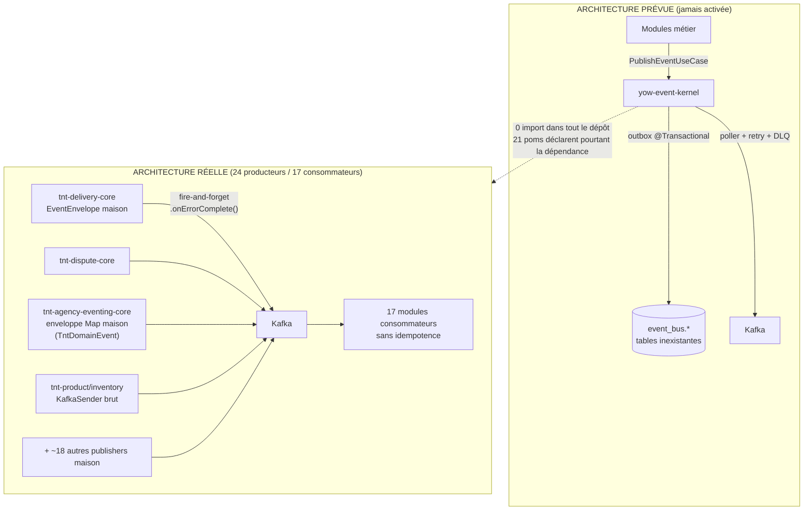

# Audit n°3 — Module `yow-event-kernel` (L0 Foundation)

- **Projet** : TiiBnTick Core (`tiibntick-core`)
- **Module audité** : `foundation/yow-event-kernel` — package `com.yowyob.kernel.event`
- **Rôle annoncé** (pom.xml, l.17-27) : « Bus événementiel transactionnel partagé par toutes les solutions TiiBnTick. Implémente le pattern Outbox, Kafka publishing pipeline, Avro schema registry, DLQ et event replay. Sera migré dans RT-comops (TSAFACK Savio) ultérieurement. »
- **Date de l'audit** : 2026-07-17
- **Auditeur** : Distributed Systems Engineer (audit statique exhaustif du code)
- **Périmètre** : le module lui-même + les 33 autres modules du réacteur, y compris `coreBackend/` (tnt-agency-back-core et ses 10 sous-modules, tnt-go-freelancer-point-back-core, tnt-link-back-core, tnt-market-back-core)

---

## 1. Résumé exécutif

`yow-event-kernel` est un module **soigneusement conçu sur le papier mais totalement mort en pratique**. Il définit une architecture événementielle sérieuse (outbox transactionnel, enveloppe standard avec correlation/causation IDs, DLQ, replay, registre de schémas Avro, idempotence Redis, métriques Micrometer) — mais :

1. **Aucune classe du package `com.yowyob.kernel.event` n'est importée par un seul fichier Java des 33 autres modules** (grep exhaustif : zéro occurrence hors du module), alors que **21 `pom.xml` déclarent la dépendance Maven**.
2. **Le module ne peut même pas s'activer** : le fichier `META-INF/spring/org.springframework.boot.autoconfigure.AutoConfiguration.imports` promis par la javadoc n'existe pas, le `@ComponentScan` pointe vers un package inexistant (`yowyob.kernel.event` au lieu de `com.yowyob.kernel.event`), et `tnt-bootstrap` ne l'importe pas.
3. **Il serait cassé s'il s'activait** : le port central `EventEnvelopeRepository` (event store) n'a **aucune implémentation**, et **aucune migration Liquibase** ne crée les 4 tables `event_bus.*` que ses entités R2DBC référencent.
4. **Toute la plateforme fait de l'événementiel sans lui** : ~24 modules publient sur Kafka via des publishers maison (`KafkaDeliveryEventPublisher`, `DisputeKafkaEventPublisher`, `KafkaAgencyEventPublisher`, etc.), en **fire-and-forget sans outbox**, avec **au moins 3 formats d'enveloppe concurrents**, aucune idempotence consommateur, et des divergences de nommage de topics qui **cassent réellement des flux** (producteur `tnt.delivery.mission.status-changed` vs consommateurs `tnt.delivery.mission.status.changed`).
5. Une **seconde abstraction événementielle partagée** (`TntDomainEvent` dans `tnt-common-core`) concurrence le kernel — elle-même adoptée par un seul module (`tnt-agency-back-core`).

**Verdict : le module ne joue aucun rôle dans l'architecture actuelle. Il est contourné à 100 %.** Le risque principal n'est pas le module lui-même, mais le vide qu'il laisse : perte d'événements silencieuse, dualité d'enveloppes, absence d'atomicité DB+publication partout.

---

## 2. État actuel — Inventaire du module

### 2.1 Structure (60 fichiers source, hexagonal propre)

```
com.yowyob.kernel.event
├── domain/
│   ├── model/        DomainEventEnvelope (agrégat, builder, machine à états),
│   │                 OutboxEntry, DeadLetterEntry, EventSchema
│   ├── vo/           EnvelopeId, OutboxEntryId, DeadLetterEntryId, SchemaId,
│   │                 RetryPolicy (backoff exponentiel), KafkaTopicConfig, EventBusStats
│   ├── enums/        EnvelopeStatus (PENDING/PUBLISHED/FAILED/RETRYING/DEAD),
│   │                 OutboxStatus, DLQStatus, SchemaCompatibility
│   └── SchemaCompatibilityViolationException
├── application/
│   ├── port/in/      PublishEventUseCase, PublishEventBatchUseCase, QueryEventUseCase,
│   │                 QueryEventStatsUseCase, ManageSchemaUseCase, ProcessDeadLetterUseCase,
│   │                 ReplayEventUseCase + commandes (PublishEventCommand, etc.)
│   ├── port/out/     EventEnvelopeRepository, OutboxEntryRepository, DeadLetterRepository,
│   │                 EventSchemaRepository, KafkaPublisherPort, KafkaTopicManagerPort,
│   │                 EventIdempotencyStorePort, EventMetricsPort, OutboxPollerPort
│   └── service/      EventPublisherService, OutboxPollerService, DeadLetterService,
│                     ReplayEventService, SchemaRegistryService, EventQueryService, EventStatsService
├── adapter/
│   ├── kafka/        KafkaEventPublisher (headers X-Yow-*), KafkaTopicManagerAdapter (AdminClient)
│   ├── cache/        RedisEventIdempotencyStore (SET NX EX)
│   ├── persistence/  4 entités @Table("event_bus.*"), 4 mappers MapStruct,
│   │                 3 repositories R2DBC (outbox avec FOR UPDATE SKIP LOCKED)
│   └── MicrometerEventMetrics
└── config/           YowEventKernelAutoConfiguration, YowEventKernelProperties (yow.event.*)
```

### 2.2 API publique

- **Enveloppe standard** : `DomainEventEnvelope` — `envelopeId`, `correlationId`, `causationId`, `eventType`, `aggregateId`, `aggregateType`, `tenantId`, `solutionCode`, `payload` JSON, `schemaVersion`, `payloadHash` SHA-256, `kafkaTopic`, `kafkaPartitionKey` (défaut = aggregateId), statut + `retryCount` + verrou optimiste (`DomainEventEnvelope.java:35-134`).
- **Headers Kafka standardisés** : `X-Yow-Envelope-Id`, `X-Yow-Correlation-Id`, `X-Yow-Solution-Code`, `X-Yow-Event-Type`, `X-Yow-Aggregate-Id`, `X-Yow-Aggregate-Type`, `X-Yow-Tenant-Id`, `X-Yow-Schema-Version`, `X-Yow-Replay` (`KafkaEventPublisher.java:48-58`).
- **Outbox** : `PublishEventUseCase.publish()` persiste enveloppe + entrée outbox `@Transactional` ; `OutboxPollerService` (poller `@Scheduled` 1 s) publie vers Kafka, gère retry/DLQ.
- **Pas d'annotations** (type `@DomainEventHandler`) ni de bus in-process : le module est purement un pipeline outbox→Kafka + administration (DLQ, replay, stats, schémas).

### 2.3 Configuration

- `YowEventKernelProperties` : `yow.event.outbox.batch-size` (50) et `yow.event.outbox.poll-interval-ms` (1000).
- `application.yaml` embarqué dans le jar contenant uniquement `spring.application.name: yow-event-kernel`.
- **Aucun** fichier `META-INF/spring/...AutoConfiguration.imports`, **aucun** changelog Liquibase (le pom déclare pourtant `liquibase-core`, l.91-92, « migrations DB schéma event_bus »).

### 2.4 Tests

- 2 classes de tests **unitaires du domaine uniquement** (571 lignes) : `YowEventKernelDomainTest`, `YowEventKernelDomainExtendedTest` — machine à états de l'enveloppe, RetryPolicy, restore.
- `YowEventKernelTestConfig` (35 lignes) : configuration Testcontainers **jamais utilisée** — aucun `*IntegrationTest`/`*IT` n'existe, alors que le pom embarque 4 dépendances Testcontainers (postgresql, kafka, junit-jupiter, redis).
- **Zéro test** sur : adapters Kafka/Redis/R2DBC, services applicatifs, poller, autoconfiguration.

---

## 3. Cartographie d'utilisation

### 3.1 Constat central

| Mesure | Résultat | Preuve |
|---|---|---|
| Fichiers Java hors module important `com.yowyob.kernel.event` | **0** | `grep -rn "com.yowyob.kernel.event" --include="*.java"` hors `foundation/yow-event-kernel` → vide |
| `pom.xml` déclarant la dépendance `yow-event-kernel` | **21** | grep sur tous les `pom.xml` |
| Modules qui publient sur Kafka **sans** le kernel | **~24** | grep `KafkaTemplate\|KafkaSender\|ReactiveKafkaProducerTemplate` |
| Modules qui consomment Kafka **sans** le kernel | **17** | grep `@KafkaListener\|ReactiveKafkaConsumerTemplate\|KafkaReceiver` |

### 3.2 Tableau module par module

Légende : **Dep pom** = dépendance Maven déclarée ; **Classes utilisées** = imports réels du package du kernel ; **Prod/Cons** = nombre de fichiers producteurs / consommateurs Kafka ad-hoc (hors tests).

| Module | Dep pom | Classes du kernel utilisées | Prod. Kafka maison | Cons. Kafka maison |
|---|---|---|---|---|
| foundation/tnt-common-core | non | aucune | — | — (définit `TntDomainEvent` concurrent) |
| foundation/tnt-auth-core | non | aucune | — | — |
| foundation/tnt-roles-core | non | aucune | — | 1 |
| foundation/tnt-platform-gateway-core | non | aucune | — | — |
| identity/tnt-actor-core | **oui** (commentaire pom : « DomainEvent, EventPublisher, Kafka bus » — faux) | aucune | 2 | 2 |
| identity/tnt-organization-core | **oui** | aucune | — (Spring `ApplicationEventPublisher`, 2 fichiers) | — |
| identity/tnt-tp-core | **oui** | aucune | 2 | 1 |
| identity/tnt-administration-core | non | aucune | 1 | — |
| logistics/tnt-geo-core | **oui** | aucune | 2 | — |
| logistics/tnt-route-core | **oui** | aucune | 2 | — |
| logistics/tnt-delivery-core | **oui** | aucune | 2 | 3 |
| logistics/tnt-dispute-core | **oui** | aucune | 4 | 1 |
| logistics/tnt-incident-core | non | aucune | 1 | 1 |
| logistics/tnt-realtime-core | **oui** | aucune | 2 | 2 |
| logistics/tnt-sync-core | **oui** | aucune | 2 | 1 |
| logistics/tnt-notify-core | **oui** | aucune | 1 | 2 |
| logistics/tnt-media-core | **oui** | aucune | — | — |
| business/tnt-resource-core | **oui** | aucune | 1 | — |
| business/tnt-product-core | non | aucune | 1 (`KafkaSender` brut) | — |
| business/tnt-inventory-core | **oui** | aucune | 1 (`KafkaSender` brut) | — |
| business/tnt-sales-core | **oui** | aucune | 1 | 1 |
| business/tnt-accounting-core | **oui** | aucune | 1 | 1 |
| billing/tnt-billing-dsl | **oui** | aucune | — | — |
| billing/tnt-billing-pricing | **oui** | aucune | — | — |
| billing/tnt-billing-cost | non | aucune | — | — |
| billing/tnt-billing-invoice | **oui** | aucune | 2 | 1 |
| billing/tnt-billing-wallet | non | aucune | 2 | 1 |
| billing/tnt-billing-report | **oui** | aucune | — | 1 |
| billing/tnt-billing-templates | non | aucune | 2 | — |
| trust/tnt-trust-core | non | aucune | 3 (+ file de retry Redis maison) | 1 |
| coreBackend/tnt-agency-back-core (10 sous-modules) | non | aucune | 3 (dont `tnt-agency-eventing-core`, module d'eventing maison complet) | 4 |
| coreBackend/tnt-market-back-core | non | aucune | 1 | 1 |
| coreBackend/tnt-go-freelancer-point-back-core | **oui** | aucune | 1 | — |
| coreBackend/tnt-link-back-core | non | aucune | 0 | 0 (aucun événementiel) |
| tnt-bootstrap | **oui** | aucune (ni `@Import` de `YowEventKernelAutoConfiguration` — `TntCoreConfig.java:31-44`) | 1 | — |

**Cas `coreBackend/` (extension de périmètre)** : aucun des 4 backends de plateforme n'utilise le kernel. `tnt-agency-back-core` a même construit son **propre module d'eventing** (`tnt-agency-eventing-core`) : `KafkaAgencyEventPublisher` publie des `TntDomainEvent` dans une enveloppe `Map<String,Object>` maison, avec routage de topics par `eventType` et — dixit sa propre javadoc — « *Publish failures are swallowed so they never fail the originating use case* » (fire-and-forget assumé). `tnt-go-freelancer-point-back-core` déclare la dépendance `yow-event-kernel` dans son pom (l.35) sans en importer une seule classe. `tnt-link-back-core` (120 fichiers Java) ne fait aucun événementiel.

### 3.3 Diagramme — architecture prévue vs réelle



---

## 4. Qui devrait l'utiliser mais ne le fait pas

**Tous les producteurs/consommateurs d'événements du dépôt.** Les cas les plus significatifs :

1. **`tnt-delivery-core`** — le module le plus critique (missions, colis). `KafkaDeliveryEventPublisher` réinvente une enveloppe privée `record EventEnvelope(eventType, aggregateId, tenantId, occurredAt, payload)` (`KafkaDeliveryEventPublisher.java:96-102`) — sans `correlationId`, sans `causationId`, sans version de schéma — et publie en best-effort avec `.onErrorComplete()` (l.64) : **un échec Kafka = événement perdu sans trace**, y compris pour `MissionStatusChangedEvent`.
2. **`tnt-agency-back-core`** — a construit un module entier (`tnt-agency-eventing-core`) qui duplique la responsabilité du kernel avec une 3ᵉ enveloppe (Map JSON) et l'avale des erreurs de publication.
3. **`tnt-dispute-core`, `tnt-incident-core`, `tnt-billing-wallet`, `tnt-trust-core`, etc.** — chacun possède son publisher maison (`DisputeKafkaEventPublisher`, `IncidentKafkaEventPublisher`, …). `tnt-trust-core` a même réimplémenté sa propre file de retry (`TrustRetryQueueDrainer`/`TrustRetryDrainService`) — fonctionnalité que le kernel offre via outbox+DLQ.
4. **`tnt-product-core`, `tnt-inventory-core`** — descendent encore plus bas : `KafkaSender<String,String>` de reactor-kafka brut, sans enveloppe du tout.
5. **`tnt-organization-core`** — publie des événements Spring in-process (`ApplicationEventPublisher`) sans pont vers Kafka ni vers le kernel.

---

## 5. Inventaire des événements

### 5.1 Définis via le kernel

**Aucun.** Le kernel ne définit aucun type d'événement métier (par conception : il transporte des payloads JSON), et aucun module ne lui en confie.

### 5.2 Événements et topics du monde parallèle

- ~120 classes d'événements de domaine réparties dans 23 modules (`find */domain/event/*.java`) : delivery 15, agency-back 14, market-back 11, resource 11, actor 9, dispute 7, wallet 6, pricing 6, realtime 6, organization 6, etc.
- Catalogue de facto : `TntKafkaTopicsConfig` (tnt-bootstrap) déclare **59 topics** `NewTopic` — mais les noms sont re-dupliqués en littéraux dans chaque module.

### 5.3 Publiés mais jamais consommés (dans ce dépôt)

**43 des 59 topics déclarés n'ont aucun `@KafkaListener` correspondant dans tout le dépôt** (diff exhaustif déclarés/consommés), dont des transitions d'état majeures :
`tnt.delivery.mission.created`, `tnt.delivery.package.delivered`, `tnt.delivery.package.picked-up`, les **7 topics `tnt.dispute.*`** (opened, resolved, escalated, evidence-added, refund-initiated, compensation-paid, closed), **9 topics `tnt.incident.*`** (created, triaged, driver.assigned, …), `tnt.billing.invoice.created`, `tnt.billing.wallet.credited/debited`, `tnt.notify.notification.delivered/failed`, `tnt.media.file.uploaded/deleted`, `tnt.sync.conflict.detected`… (Certains sont peut-être destinés à des consommateurs externes au dépôt, mais rien ne le documente.) On y trouve aussi `tnt.outbox.events` et `tnt.dlq` — topics visiblement prévus pour le kernel, alimentés par personne.

### 5.4 Consommés mais jamais déclarés au catalogue

14+ topics écoutés sans être déclarés dans `TntKafkaTopicsConfig` : `tnt.delivery.mission.completed/started/failed`, `tnt.freelancer_org.created/verified/sub_deliverer.*`, `tnt.vehicle.assigned_to_mission/released_from_mission`, `tnt.billing.commission.calculated`, `tnt.billing.invoice.paid`, `tnt.roles.permission-changed`…

### 5.5 Rupture de flux avérée (nommage)

- **Producteur** : `tnt.delivery.mission.status-changed` (`KafkaDeliveryEventPublisher.java:33`, déclaré ainsi dans `TntKafkaTopicsConfig.java:37`).
- **Consommateurs** : `tnt.delivery.mission.status.changed` (avec un point) dans `tnt-incident-core` (`IncidentEventConsumer.java:35`), `tnt-sync-core` (`EntityChangedEventConsumer.java:46,79`) et `tnt-realtime-core` (`RealtimeProperties.java:65`, `MissionStatusEventConsumer.java:50`). Seul `tnt-market-back-core` écoute la bonne variante (`MarketKafkaConsumer.java:33`).
- **Conséquence** : les changements de statut de mission **n'atteignent jamais** incident, sync et realtime. C'est exactement la classe de bug qu'un catalogue de topics centralisé (rôle du kernel) élimine.

### 5.6 Événements manquants évidents

Sans event storming complet, deux absences ressortent : (1) `tnt-organization-core` (cycle de vie FreelancerOrganization) ne publie **aucun** événement Kafka — or `tnt-notify-core` écoute `tnt.admin.freelancer_org.*` et `tnt.freelancer_org.*` (produits ailleurs) ; (2) aucun événement d'échec de publication n'existe nulle part puisque les échecs sont avalés.

---

## 6. Cohérence de l'architecture événementielle

| Critère | Dans le kernel (théorie) | Dans la plateforme (réalité) |
|---|---|---|
| Enveloppe standard | Oui — `DomainEventEnvelope` complet | **Non** — ≥3 formats : record privé delivery (5 champs), Map JSON agency, payloads nus (`KafkaSender`), + `TntDomainEvent` |
| Versioning de schéma | Oui — `schemaVersion` + registre Avro | **Non** — aucun module ne versionne ses payloads |
| Correlation / causation ID | Oui — champs dédiés + headers | **Non** — aucun publisher maison ne les propage |
| Tenant propagé | Oui — champ + header `X-Yow-Tenant-Id` | Partiel — présent dans l'enveloppe delivery et agency, absent des payloads nus ; jamais en header |
| Sérialisation cohérente | JSON payload + Avro prévu (adapter Avro jamais écrit) | **Non** — Jackson par module (`deliveryObjectMapper`, mapper agency…), conventions divergentes |
| Outbox / atomicité DB+publication | Oui — `EventPublisherService` `@Transactional` + poller | **Non, nulle part** — publication directe dans le flux applicatif ; `.onErrorComplete()` (delivery l.64), « failures are swallowed » (agency) |
| Garantie de livraison | At-least-once (annoncée à tort « exactly-once ») | **At-most-once de fait** — perte silencieuse sur échec broker |
| Idempotence consommateur | Oui — `RedisEventIdempotencyStore` (SET NX EX) | **Non** — aucun consommateur ne déduplique par eventId |
| DLQ / retry | Oui — DLQ persistée + `RetryPolicy` | Quasi absent — `tnt-trust-core` a sa file Redis maison ; topic `tnt.sync.entity-changed.dlq` déclaré ; le reste : rien |
| Replay | Oui — `ReplayEventService` + header `X-Yow-Replay` | **Non** — impossible, les événements ne sont persistés nulle part |

---

## 7. Points positifs

1. **Conception domaine solide** : machine à états explicite de l'enveloppe avec invariants (`markPublished`/`markFailed`/`scheduleRetry`, `DomainEventEnvelope.java:238-299`), factories `wrap()`/`restore()` séparant création et réhydratation, VOs typés (`EnvelopeId`, `RetryPolicy` record validé, `RetryPolicy.java:254-267`).
2. **Vrai pattern outbox** correctement pensé : écriture enveloppe+outbox dans la transaction appelante (`EventPublisherService.java`, `@Transactional`), poller avec `SELECT … FOR UPDATE SKIP LOCKED` (`R2dbcOutboxEntryRepository.java:47,57`) — le bon mécanisme pour le multi-instance.
3. **Headers Kafka standardisés `X-Yow-*`** incluant tenant, corrélation, type et version de schéma — exactement ce qui manque au reste de la plateforme.
4. **Idempotence atomique** : `SET NX EX` Redis (`RedisEventIdempotencyStore.java:56-60`), sans race condition.
5. **Observabilité prévue** : compteurs/timers/gauges Micrometer tagués (eventType, solutionCode, tenantId), erreurs de métrique non propagées (`MicrometerEventMetrics.java`).
6. **Autoconfiguration à la Spring Boot** : tous les beans en `@ConditionalOnMissingBean`, surchageables par l'application hôte.
7. **Tests domaine réels** (571 lignes) couvrant la machine à états et les policies.
8. **Documentation interne abondante** (javadoc riche, intentions claires) — la vision est la bonne, y compris la cible de migration vers RT-comops.

---

## 8. Problèmes détectés — tableau de synthèse

| # | Problème | Localisation | Criticité |
|---|---|---|---|
| P1 | Module jamais activé : pas de fichier `AutoConfiguration.imports`, pas d'`@Import` dans bootstrap | `src/main/resources/` (seul `application.yaml`) ; `TntCoreConfig.java:31-44` | **Critique** |
| P2 | `@ComponentScan` sur un package inexistant (`yowyob.kernel.event`) | `YowEventKernelAutoConfiguration.java:58` | **Critique** |
| P3 | Port `EventEnvelopeRepository` (event store) sans aucune implémentation | `application/port/out/EventEnvelopeRepository.java` ; grep `implements EventEnvelopeRepository` → 0 | **Critique** |
| P4 | Aucune migration DB pour les 4 tables `event_bus.*` référencées | `DomainEventEnvelopeEntity.java:47`, `OutboxEntryEntity.java:29`, `DeadLetterEntryEntity.java:33`, `EventSchemaEntity.java:35` ; 0 changelog dans le dépôt | **Critique** |
| P5 | 100 % des flux événementiels contournent le kernel : fire-and-forget sans outbox, perte d'événements silencieuse | `KafkaDeliveryEventPublisher.java:64` (`.onErrorComplete()`) ; `KafkaAgencyEventPublisher` (« failures are swallowed ») ; ~24 modules | **Critique** |
| P6 | Divergence de topic producteur/consommateurs : `status-changed` vs `status.changed` → incident/sync/realtime ne reçoivent jamais les statuts de mission | `KafkaDeliveryEventPublisher.java:33` vs `IncidentEventConsumer.java:35`, `EntityChangedEventConsumer.java:46`, `RealtimeProperties.java:65` | **Critique** |
| P7 | 21 poms déclarent une dépendance jamais utilisée (dette, temps de build, fausse impression d'intégration — commentaires pom mensongers) | ex. `identity/tnt-actor-core/pom.xml:36` (« DomainEvent, EventPublisher, Kafka bus ») | **Élevé** |
| P8 | ≥3 formats d'enveloppe concurrents + 2 abstractions partagées (`DomainEventEnvelope` vs `TntDomainEvent`) — aucune interopérabilité | `KafkaDeliveryEventPublisher.java:96-102` ; `tnt-common-core/.../TntDomainEvent.java` ; `KafkaAgencyEventPublisher.java:66-71` | **Élevé** |
| P9 | Aucune idempotence/déduplication côté consommateurs (17 modules) malgré livraison at-least-once de Kafka | tous les `@KafkaListener` du dépôt | **Élevé** |
| P10 | Javadoc contractuellement fausse : « exactly-once » (pipeline réellement at-least-once) ; « blocks until the reactive chain completes » (en réalité `subscribe()` fire-and-forget) | `DomainEventEnvelope.java:15` ; `OutboxPollerService.java:78-92` | **Élevé** |
| P11 | Catalogue de topics éclaté : 59 déclarés / 43 sans consommateur repo / 14+ consommés non déclarés ; littéraux dupliqués partout | `TntKafkaTopicsConfig.java` + diff exhaustif §5.3-5.4 | **Élevé** |
| P12 | `yow.event.outbox.batch-size` défini mais ignoré (constante 50 codée en dur ; `YowEventKernelProperties` jamais injecté dans le poller) | `OutboxPollerService.java:50,110` vs `YowEventKernelProperties.java` | Moyen |
| P13 | Poller : `findById(envelopeId, null)` — tenantId non propagé alors que `entry.getTenantId()` est disponible | `OutboxPollerService.java:122` | Moyen |
| P14 | Contrôle de compatibilité Avro non implémenté : la javadoc référence un `AvroSchemaCompatibilityChecker` inexistant ; le code « trust the compatibility passed by the caller » | `SchemaRegistryService.java:23,49` | Moyen |
| P15 | Couplage inversé kernel→TiiBnTick : `@Qualifier("tntKafkaTemplate")` (bean défini par tnt-bootstrap) dans un module censé être générique Yowyob/RT-comops | `KafkaEventPublisher.java:60` ; idem `RedisEventIdempotencyStore.java:33` | Moyen |
| P16 | `LocalDateTime` (sans fuseau) pour tous les horodatages d'un bus distribué — au lieu d'`Instant`/`OffsetDateTime` | `DomainEventEnvelope.java:105-107`, `OutboxEntry.java:78-79` | Moyen |
| P17 | Enveloppe introuvable → entrée outbox marquée `PROCESSED` silencieusement (perte maquillée en succès) | `OutboxPollerService.java:209-214` | Moyen |
| P18 | Overlap de cycles de poll possible : `@Scheduled` + `subscribe()` asynchrone annule la garantie fixed-delay ; seul l'`AtomicBoolean` (mono-instance) protège | `OutboxPollerService.java:85-92,105` | Moyen |
| P19 | `publishAll` : javadoc « single bulk-insert » mais implémentation en `flatMap` unitaire non ordonné ; renvoie le compte d'enveloppes, pas d'outbox | `EventPublisherService.java:75-100` | Faible |
| P20 | `application.yaml` embarqué dans un jar bibliothèque (`spring.application.name`) — risque de collision de config avec l'app hôte | `src/main/resources/application.yaml` | Faible |
| P21 | `@EnableScheduling` global dans une autoconfiguration de bibliothèque (effet de bord sur l'app hôte) | `YowEventKernelAutoConfiguration.java:56` | Faible |
| P22 | Aucun test d'intégration malgré 4 dépendances Testcontainers ; adapters et services 0 % couverts | pom l.100-127 ; `src/test/` (3 fichiers) | Faible |

---

## 9. Détails et preuves des problèmes majeurs

### P1-P2 — Le module ne peut pas démarrer

La javadoc de `YowEventKernelAutoConfiguration` (l.40-42) affirme : « *This class is discovered automatically by Spring Boot via the `META-INF/spring/org.springframework.boot.autoconfigure.AutoConfiguration.imports` file included in the module JAR* ». Or `src/main/resources/` ne contient **que** `application.yaml`. Sans ce fichier, `@AutoConfiguration` n'est jamais chargée. Aucun `@Import(YowEventKernelAutoConfiguration.class)` n'existe dans `tnt-bootstrap` (`TntCoreConfig.java:31-44` importe 12 configurations, pas celle-ci).

Même si elle était chargée :

```java
// YowEventKernelAutoConfiguration.java:58
@ComponentScan(basePackages = "yowyob.kernel.event")   // ← package inexistant, il manque "com."
```

Les adapters `@Component` (`KafkaEventPublisher`, `RedisEventIdempotencyStore`, `KafkaTopicManagerAdapter`, `MicrometerEventMetrics`) et les `@Repository` ne seraient donc **jamais scannés** — et les beans `@Bean` de la classe échoueraient faute de `EventEnvelopeRepository`, `KafkaPublisherPort`, etc.

### P3-P4 — Il serait cassé s'il démarrait

- `adapter/persistence/repository/` contient `R2dbcOutboxEntryRepository`, `R2dbcDeadLetterRepository`, `R2dbcEventSchemaRepository` — **pas de `R2dbcEventEnvelopeRepository`**, alors que 6 des 8 beans de l'autoconfiguration en dépendent. Le mapper `EventEnvelopeMapper` existe, orphelin.
- Les entités mappent `event_bus.domain_event_envelopes`, `event_bus.outbox_entries`, `event_bus.dead_letter_entries`, `event_bus.event_schemas`. Un grep `event_bus|outbox_entr|dead_letter` sur tous les `.xml/.sql/.yaml` du dépôt ne renvoie **que** le pom du module. Le schéma n'existe nulle part.

### P5 — Le vide opérationnel : perte d'événements silencieuse

```java
// KafkaDeliveryEventPublisher.java:59-66
return serializeEvent(event)
        .flatMap(payload -> Mono.fromFuture(kafkaTemplate.send(topic, ...))
                ...
                .onErrorComplete()  // best-effort: notification failure must not block delivery
                .then());
```

Un broker indisponible 30 s = tous les `MissionStatusChangedEvent` de la fenêtre perdus, sans persistance, sans retry, sans DLQ, sans alerte métier. Même philosophie côté agency (« *Publish failures are swallowed* »), et les erreurs de sérialisation retournent `Mono.empty()` (l.87-90). C'est un régime **at-most-once** sur des événements métier structurants — précisément ce que l'outbox du kernel devait empêcher.

### P10 — Sémantique de livraison mal étiquetée dans le kernel lui-même

- `DomainEventEnvelope.java:15` : « *durable, exactly-once delivery* ». Le pipeline réel (`OutboxPollerService.publishAndCommit`, l.135-160) publie sur Kafka **puis** met à jour la DB, sans transaction ni producteur idempotent/transactionnel Kafka : un crash entre les deux rejoue l'événement. C'est de l'at-least-once (ce que dit d'ailleurs correctement `OutboxEntry.java:61-63`).
- `OutboxPollerService.java:78-82` : « *Delegates to poll() and blocks until the reactive chain completes. The @Scheduled fixed-delay semantics guarantee that the next cycle does not start until the current one finishes* » — faux : `scheduledPoll()` fait `poll().subscribe(...)` (l.85) et retourne immédiatement.

### P22 (contexte) — La seconde abstraction : `TntDomainEvent`

`foundation/tnt-common-core/.../domain/event/TntDomainEvent.java` définit un contrat complet (eventId, eventType, aggregateId/type, tenantId, occurredAt, correlationId, sequenceNumber) accompagné de `TntDomainEventMetadata`. Sa javadoc (l.13-14) prétend : « *Concrete events are serialized via the Outbox pattern (in `tnt-kernel-core`) and published to Kafka topics defined in `yow-event-kernel`* » — **doublement faux** : `tnt-kernel-core` n'existe pas dans ce dépôt, et `yow-event-kernel` ne définit aucun topic. Adoption réelle : **uniquement `coreBackend/tnt-agency-back-core`** (16 fichiers). Les modules cœur (delivery, dispute, incident…) utilisent leurs propres interfaces locales (`DeliveryDomainEvent`, `MarketDomainEvent`…). La plateforme a donc **deux standards d'événement partagés, tous deux quasi ignorés**, plus une interface locale par module.

---

## 10. Recommandations priorisées

### PR1 — Décider du sort du module (Critique, décision d'architecture — à arbitrer avec l'équipe)
Deux options cohérentes ; l'entre-deux actuel (dépendance déclarée partout, code mort) est la pire :
- **Option A (recommandée)** : réhabiliter `yow-event-kernel` comme unique voie de publication, dans le cadre de sa migration RT-comops prévue.
- **Option B** : l'abandonner explicitement, retirer les 21 dépendances pom, et promouvoir `TntDomainEvent` + un publisher commun dans `tnt-common-core`.

### PR2 — Corriger la rupture de topic mission.status (Critique, immédiat, indépendant de PR1)
Aligner `tnt-incident-core`, `tnt-sync-core`, `tnt-realtime-core` sur `tnt.delivery.mission.status-changed` (ou inversement), et **centraliser les noms de topics dans une classe de constantes partagée** (`tnt-common-core`) référencée par producteurs, consommateurs et `TntKafkaTopicsConfig`.

### PR3 — Si option A : rendre le module démarrable (Critique)
1. Créer `META-INF/spring/org.springframework.boot.autoconfigure.AutoConfiguration.imports` avec `com.yowyob.kernel.event.config.YowEventKernelAutoConfiguration`.
2. Corriger `@ComponentScan(basePackages = "com.yowyob.kernel.event")`.
3. Écrire `R2dbcEventEnvelopeRepository`.
4. Écrire les changelogs Liquibase des 4 tables `event_bus.*` et les raccorder au master changelog de bootstrap.
5. Supprimer le `@Qualifier("tntKafkaTemplate")` codé en dur (injecter un `KafkaTemplate` non qualifié, surchargeable) et l'`application.yaml` du jar.
6. Ajouter les tests d'intégration Testcontainers déjà outillés dans le pom (outbox de bout en bout, DLQ, replay, crash entre publish et commit).

### PR4 — Stopper la perte d'événements (Élevé, même sans PR1)
Interdire `.onErrorComplete()`/avalage d'erreurs dans les publishers d'événements métier ; à minima logger en ERROR + métrique + retry ; à terme, brancher les publishers sur l'outbox du kernel (les modules gardent leur port `I...EventPublisher`, seul l'adapter change — le pattern trust/CLAUDE.md s'applique).

### PR5 — Unifier l'enveloppe (Élevé)
Une seule enveloppe (celle du kernel : correlationId, causationId, tenantId, schemaVersion, headers `X-Yow-*`) et un seul contrat (`TntDomainEvent` aligné dessus). Migrer les 3 formats existants ; documenter le versioning.

### PR6 — Idempotence consommateurs (Élevé)
Généraliser `checkAndMark(eventId)` (le `RedisEventIdempotencyStore` du kernel est prêt) dans les 17 modules consommateurs, en commençant par billing/wallet (risque financier des doublons).

### PR7 — Hygiène (Moyen/Faible)
Corriger les javadocs mensongères (« exactly-once », fixed-delay, bulk-insert, imports file), injecter `YowEventKernelProperties` dans le poller (batch-size), propager `entry.getTenantId()` dans `processEntry`, passer les horodatages en `Instant`, implémenter ou retirer le contrôle de compatibilité Avro, remplacer le `PROCESSED` silencieux de `handleMissingEnvelope` par un statut d'erreur dédié, retirer `@EnableScheduling` au profit d'une activation conditionnelle.

---

## 11. Conclusion — verdict

`yow-event-kernel` est un **excellent document d'architecture déguisé en module Maven**. Sa conception (outbox, enveloppe riche, DLQ, replay, idempotence) est précisément ce dont la plateforme a besoin — la preuve : chaque module en a réimplémenté un fragment dégradé. Mais dans son état actuel, il est : jamais activé (P1-P2), inexécutable (P3-P4), et contourné par 100 % des flux événementiels (P5). Les 21 dépendances pom donnent une illusion d'intégration que le code dément totalement. Pendant ce temps, la plateforme réelle fonctionne en fire-and-forget sans garantie de livraison, avec trois enveloppes incompatibles, aucune idempotence, et au moins un flux inter-modules structurellement rompu par une faute de nommage de topic. **Le module ne joue pas son rôle central ; il faut soit le réhabiliter et y raccorder les publishers existants (option recommandée, cohérente avec la migration RT-comops annoncée), soit l'assumer comme abandonné et le retirer — mais pas le laisser en l'état.**

---
*Audit réalisé par analyse statique exhaustive : inventaire complet des 60 sources du module, grep des imports sur les 34 modules (y compris coreBackend/), lecture intégrale des services/adapters du kernel, échantillonnage des publishers/consommateurs ad-hoc, diff exhaustif topics déclarés/consommés.*
