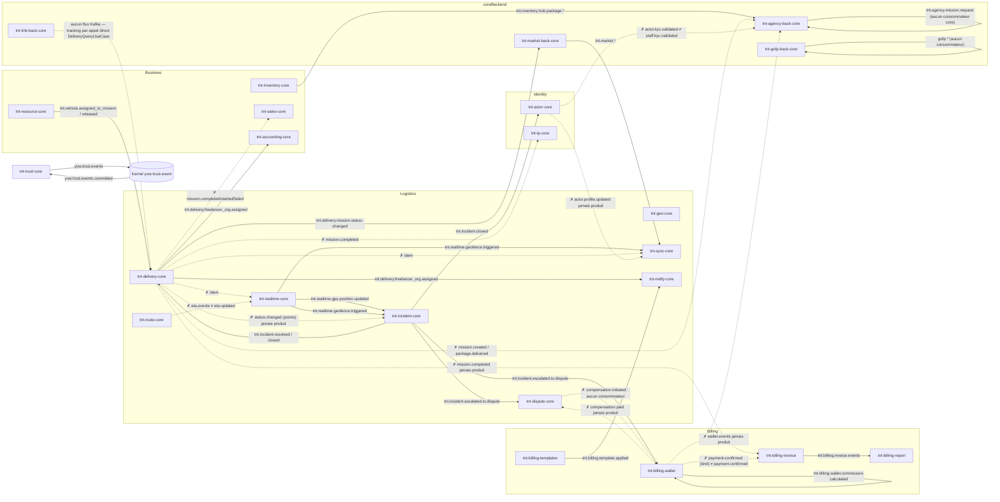

# Audit n°5 — Kafka — TiiBnTick Core

**Auditeur** : Distributed Systems Engineer (spécialiste Kafka)
**Date** : 2026-07-17
**Périmètre** : tout le dépôt `tiibntick-core` (~34 modules Maven, y compris `coreBackend/` : tnt-agency-back-core, tnt-go-freelancer-point-back-core, tnt-link-back-core, tnt-market-back-core). Basé exclusivement sur le code et la configuration réels du dépôt.

---

## 1. Résumé exécutif

L'architecture événementielle de TiiBnTick Core est **structurée mais fragmentée et partiellement câblée dans le vide**. Les fondations sont saines : producteurs majoritairement idempotents (`acks=all`, `enable.idempotence=true`), auto-commit désactivé partout, un embryon de DLQ dans tnt-sync-core, des topics provisionnés centralement (`TntKafkaTopicsConfig`), et une enveloppe d'événements riche en headers dans `yow-event-kernel`.

Mais l'audit révèle un problème systémique **critique** : **plus de 20 topics consommés n'ont aucun producteur dans le dépôt**, dont une grande partie à cause d'incohérences de nommage tiret/point (`tnt.delivery.mission.status-changed` produit vs `tnt.delivery.mission.status.changed` consommé ; `tnt.billing.wallet.payment-confirmed` produit vs `tnt.billing.wallet.payment.confirmed` consommé ; `tnt.route.eta.events` produit vs `tnt.route.eta.updated` consommé ; `tnt.actor.kyc.validated` produit vs `tnt.staff.kyc.validated` consommé). Concrètement : la facturation à la livraison, la comptabilité des paiements, le temps réel des missions, l'onboarding RH de l'Agency ERP et l'escalade litige→remboursement **ne peuvent pas fonctionner de bout en bout** aujourd'hui.

Second problème critique : **6 consommateurs utilisent la factory Spring Boot par défaut** dont le deserializer de valeur est `ByteArrayDeserializer` (application.yml), alors que leurs méthodes attendent des `String` — incompatibilité de type à l'exécution.

Enfin : une seule DLQ pour tout le système (sync uniquement), aucune transaction/outbox réelle (le topic `tnt.outbox.events` existe mais aucun code outbox), publication non atomique avec la DB (perte d'événements possible), aucune déduplication consommateur, PLAINTEXT sans ACL, et aucune métrique Kafka Micrometer sur les factories construites manuellement.

**Verdict global : 4/10** — bonne intention architecturale, exécution incohérente entre modules, plusieurs flux métier cassés silencieusement (`auto.create.topics.enable=true` masque tout : les topics orphelins sont créés à la volée et les consommateurs attendent des messages qui n'arriveront jamais).

---

## 2. État actuel — Configuration

### 2.1 Broker (docker-compose — dev local uniquement)

`tnt-bootstrap/docker-compose.yml:88-122` :

| Paramètre | Valeur | Commentaire |
|---|---|---|
| Image | `confluentinc/cp-kafka:7.7.0` (KRaft, mono-nœud) | OK pour dev |
| `KAFKA_AUTO_CREATE_TOPICS_ENABLE` | `"true"` (l.111) | **Masque les topics orphelins** (créés avec les defaults broker : 1 partition) |
| `KAFKA_OFFSETS_TOPIC_REPLICATION_FACTOR` | 1 | dev only |
| `KAFKA_TRANSACTION_STATE_LOG_REPLICATION_FACTOR / MIN_ISR` | 1 / 1 | inutilisé (aucune transaction dans le code) |
| Rétention | 168 h | uniforme, non différenciée par topic |
| Listeners | `PLAINTEXT` partout (l.98-101) | aucun SASL/TLS, aucune ACL |

### 2.2 Spring (`tnt-bootstrap/src/main/resources/application.yml:40-60`)

```yaml
spring.kafka:
  producer:
    key-serializer: StringSerializer
    value-serializer: ByteArraySerializer      # ← incohérent avec tous les usages String
    acks: all
    retries: 3
    properties:
      enable.idempotence: true
      max.in.flight.requests.per.connection: 1  # ← inutilement restrictif avec idempotence (≤5 suffit)
  consumer:
    group-id: tiibntick-core                    # ← group-id GLOBAL partagé par défaut
    value-deserializer: ByteArrayDeserializer   # ← source du bug des consommateurs "default factory"
    auto-offset-reset: earliest
    enable-auto-commit: false
    properties:
      isolation.level: read_committed           # ← sans objet : aucun producteur transactionnel
  admin:
    auto-create: true
tnt.kafka: partitions 3 (dev) / 3 (staging, RF 2) / 6 (prod, RF 3)   # application.yml:314,482,555
```

### 2.3 Configurations par module — synthèse

| Config | acks | idempotence | compression | linger/batch | offset-reset | auto-commit | AckMode | concurrency | Error handler | ErrorHandlingDeserializer |
|---|---|---|---|---|---|---|---|---|---|---|
| `TntKafkaConfig` (bootstrap, `tntKafkaTemplate`+`tntKafkaSender`) | all | oui | lz4 (template) / aucune (sender) | non | — | — | — | — | — | — |
| `DeliveryModuleConfig` | all | oui | non | non | earliest | non | défaut (BATCH) | 2 | **aucun** | non |
| `IncidentKafkaConfig` | all (implicite idempotence) | oui | non | non | earliest | non | défaut | 2 | **aucun** | non |
| `KafkaRealtimeConfig` | all | oui | lz4 | non | earliest | non | MANUAL | 2 | défaut (pas de DLQ) | **oui** |
| `SyncKafkaConfig` | all | oui | lz4 | non | earliest | non | MANUAL | 2 | **DefaultErrorHandler + DLQ** (FixedBackOff 1 s ×3) | **oui** |
| `DisputeKafkaConfig` | all | oui | lz4 | non | earliest | non | MANUAL_IMMEDIATE | ? | **aucun** | non |
| `NotifyCoreAutoConfiguration` | (producteur = tntKafkaTemplate) | — | — | — | earliest | non | ? | 2 | **aucun** | non |
| `GeoCoreConfig` | **"1"** | **false** | non | non | — | — | — | — | — | — |
| `RouteCoreConfig` | **"1"** | ? | non | non | — | — | — | — | — | — |
| `ActorCoreConfig` | all | oui | non | non | — | — | — | — | — | — |
| `TntTpKafkaConfig` | all | oui | non | non | earliest | non | défaut | 2 | **aucun** | non |
| `WalletModuleConfig` | all | oui | non | non | earliest | non | défaut | ? | **aucun** | non |
| `TntBillingInvoiceAutoConfiguration` | all | oui | non | non | earliest | non | défaut | 2 | **aucun** | non |
| `TntBillingReportAutoConfiguration` | — | — | — | — | earliest | non | défaut | 2 | **aucun** | non |
| `KafkaProducerConfig` (trust) | all | oui | lz4 | **linger 5 ms / batch 16 Ko** | earliest | non | MANUAL_IMMEDIATE | 1 | **aucun** | non |
| `TntRolesKafkaConfig` | — | — | — | — | earliest | non | défaut | 1 | **aucun** | non |
| `AgencyEventingKafkaProducerConfig` | all | oui | non | non | — | — | — | — | — | — |
| `Agency*KafkaConfig` (4 consumers ERP) | — | — | — | — | earliest | non | MANUAL_IMMEDIATE | ? | **aucun** | non |
| Factory Boot par défaut (`kafkaListenerContainerFactory`) | — | — | — | — | earliest | non | BATCH | 1 | DefaultErrorHandler (10 essais puis **skip sans DLQ**) | non |

Constat : ~15 factories producteur/consommateur quasi identiques recopiées dans chaque module, avec dérives locales (geo/route en `acks=1`, seul trust règle linger/batch, seuls sync/realtime ont `ErrorHandlingDeserializer`, seul sync a une DLQ).

---

## 3. Cartographie complète des flux

### 3.1 Tableau exhaustif producteurs → consommateurs

Légende clé : la « clé » est la clé de partitionnement réellement passée à `send()`. **⚠ ORPHELIN** = topic consommé sans producteur trouvé dans le dépôt (ou produit sans consommateur interne). Tous les payloads sont du **JSON sérialisé en String** (sauf mention).

#### Flux appariés (fonctionnels)

| Topic (source du nom) | Producteur (module / classe) | Clé | Consommateur (module / classe, groupe) |
|---|---|---|---|
| `tnt.incident.escalated.to.dispute` (dur) | tnt-incident-core `IncidentKafkaEventPublisher` | incidentId | tnt-dispute-core `DisputeEventConsumer` (tnt-dispute-core-group) ; tnt-billing-wallet `WalletBillingEventConsumer` (tnt-billing-wallet-dispute-freeze) |
| `tnt.incident.resolved` / `tnt.incident.closed` (dur) | tnt-incident-core | incidentId | tnt-delivery-core `IncidentEventConsumer` (**factory par défaut**, groupe `tiibntick-core`) ; tnt-actor-core `IncidentEventConsumer` (closed, idem) |
| `tnt.vehicle.assigned_to_mission` / `tnt.vehicle.released_from_mission` (dur) | tnt-resource-core `ResourceKafkaEventPublisher` (KafkaSender réactif) | ? (voir code) | tnt-delivery-core `FreelancerVehicleEventConsumer` (tnt-delivery-core) |
| `tnt.delivery.freelancer_org.assigned` (dur) | tnt-delivery-core `KafkaDeliveryEventPublisher` | aggregateId | tnt-notify-core `FreelancerOrgKafkaEventConsumer` (tnt-notify-core) ; tnt-accounting-core `BillingEventAccountingConsumer` (**factory par défaut**, tnt-accounting-core) |
| `tnt.delivery.mission.status-changed` (dur, **tiret**) | tnt-delivery-core (MissionStatusChangedEvent) | aggregateId (missionId) | tnt-market-back-core `MarketKafkaConsumer` (tnt-market-group, **factory par défaut**) — seul consommateur aligné sur le tiret |
| `tnt.realtime.gps.position.updated` (dur) | tnt-realtime-core `KafkaRealtimeEventPublisher` | **eventId (aléatoire !)** | tnt-incident-core `IncidentEventConsumer` (tnt-incident-core) |
| `tnt.realtime.geofence.triggered` (dur) | tnt-realtime-core | eventId | tnt-incident-core ; tnt-sync-core `EntityChangedEventConsumer` (tnt-sync-core) |
| `tnt.inventory.hub.package.deposited` / `.pickedup` (dur) | tnt-inventory-core `InventoryKafkaEventPublisher` (KafkaSender) | ? | tnt-agency-org-core `InventoryHubConsumer` (tnt-agency-erp-inventory-consumer, via `${tnt.kafka.topics.consumed.*}`) |
| `tnt.billing.invoice.events` (config `tnt.kafka.topics.invoice-events`) | tnt-billing-invoice `KafkaInvoiceEventPublisher` | invoiceId | tnt-billing-report `InvoiceEventReportConsumer` (tnt-billing-report-group) |
| `tnt.billing.wallet.commission-calculated` (dur) | tnt-billing-wallet `WalletKafkaPublisher` | delivererId | tnt-billing-wallet `WalletBillingEventConsumer` (tnt-billing-wallet-commission) — boucle intra-module |
| `tnt.billing.template.applied` (dur) | tnt-billing-templates `KafkaTemplateEventPublisher` | ? | tnt-notify-core `FreelancerOrgKafkaEventConsumer` |
| `tnt.market.listing.published` … `tnt.market.merchant.contract.signed` (dérivés du nom de classe, préfixe `tnt.market.`) | tnt-market-back-core `MarketKafkaEventPublisher` (tntKafkaTemplate) | aggregateId | tnt-sync-core `EntityChangedEventConsumer` (10 topics market) |
| `yow.trust.events` (dur, configurable `tnt.trust.kafka-trust-events-topic`) | tnt-trust-core `KafkaTrustEventPublisherAdapter` | entityId | **externe** : microservice Kernel yow-trust-event |
| `yow.trust.events.committed` (dur) | **externe** (yow-trust-event) | — | tnt-trust-core `TrustCommittedEventConsumer` (tnt-trust-committed-listener) |

#### Topics produits sans consommateur interne (sorties « fire and forget » — acceptable si contrat externe, sinon code mort)

| Topic | Producteur | Clé |
|---|---|---|
| `tnt.delivery.events` (fourre-tout, enveloppe EventEnvelope) | tnt-delivery-core | aggregateId |
| `tnt.incident.created/status.changed/triaged/driver.assigned/handover.completed/cancelled/escalated/interagency.*` | tnt-incident-core | incidentId |
| `tnt.geo.traffic.events` / `node.events` / `zone.events` | tnt-geo-core (**acks=1, idempotence=false**) | **tenantId** |
| `tnt.route.tour.events` / `eta.events` / `reroute.events` / `vrp.events` | tnt-route-core (**acks=1**) | tenantId ou missionId |
| `tnt.realtime.eta.updated`, `tnt.realtime.actor.connected/disconnected` | tnt-realtime-core | eventId |
| `tnt.sync.entity.version.changed`, `tnt.sync.conflict.detected`, `tnt.sync.completed` | tnt-sync-core | eventId |
| `tnt.dispute.opened/status.changed/evidence.submitted/ruled/escalated/compensation.processed/closed` | tnt-dispute-core `DisputeKafkaEventPublisher` | disputeId |
| `tnt.delivery.package.disputed` / `.dispute.released` | tnt-dispute-core `DeliveryStatusAdapter` | packageId |
| `tnt.billing.compensation.initiated` | tnt-dispute-core `BillingCompensationAdapter` | disputeId |
| `tnt.notify.*` (requested/delivered/failed) | tnt-notify-core `KafkaNotificationPublisherAdapter` | notificationId |
| `tnt.actor.status.changed/location.updated/badge.earned/kyc.validated/mission.assigned/freelancer.*` | tnt-actor-core `KafkaActorEventPublisher` | actorId |
| `tnt.tp.client.profile/kyc/loyalty/rating/phone.alias/.events` (+ `tnt.tp.unknown.events`) | tnt-tp-core | clientId |
| `tnt.administration.events` | tnt-administration-core | tenantId |
| `tnt.product.created`, `tnt.product.offer.published` | tnt-product-core (KafkaSender) | ? |
| `tnt.inventory.stock.low` | tnt-inventory-core | ? |
| `tnt.resource.vehicle.*`, `tnt.resource.freelancer.vehicle.registered` | tnt-resource-core | ? |
| `tnt.sales.order.confirmed/dispatched/delivered/cancelled` | tnt-sales-core | ? |
| `tnt.accounting.journal-entry.posted`, `tnt.accounting.period.closed` | tnt-accounting-core | tenantId |
| `tnt.agency.events`, `tnt.agency.mission.request`, `tnt.agency.staff.events`, `tnt.agency.contract.events` (config `tnt.kafka.topics.produced.*`) | tnt-agency-eventing-core `KafkaAgencyEventPublisher` | **tenantId** |
| `tnt.agency.claims.submitted` (config) | tnt-agency-compliance-core `ClaimsKafkaPublisher` | tenantId |
| `gofp.announcement.published`, `gofp.delivery.completed`, `gofp.subscription.suspended` | tnt-go-freelancer-point-back-core `KafkaGofpEventPublisher` | announcement/delivery/subscriptionId |

#### ⚠ Topics consommés SANS producteur dans le dépôt (flux cassés ou dépendant d'un producteur externe non documenté)

| Topic consommé | Consommateur(s) | Producteur attendu / cause |
|---|---|---|
| `tnt.delivery.mission.status.changed` (**points**) | tnt-incident-core, tnt-sync-core, tnt-realtime-core `MissionStatusEventConsumer`, tnt-agency (yml `core-mission-status`) | delivery publie `…status-changed` (**tiret**) — mismatch de nommage |
| `tnt.delivery.mission.completed` | tnt-billing-invoice, tnt-tp-core, tnt-sales-core | jamais publié (les événements delivery partent dans `tnt.delivery.events`) |
| `tnt.delivery.mission.started` / `.failed` | tnt-sales-core | jamais publiés |
| `tnt.delivery.mission.created` | tnt-agency-assignment (`core-mission-created`) | jamais publié (topic déclaré dans TntKafkaTopicsConfig seulement) |
| `tnt.delivery.package.delivered` | tnt-agency-assignment | jamais publié |
| `tnt.delivery.package.updated` | tnt-sync-core | jamais publié |
| `tnt.billing.wallet.payment.confirmed` (**points**) | tnt-billing-invoice | wallet publie `tnt.billing.wallet.payment-confirmed` (**tiret**) |
| `tnt.billing.payment.confirmed` | tnt-accounting-core, tnt-market-back-core | personne (ni la variante wallet, ni celle-ci) |
| `tnt.billing.invoice.paid` | tnt-accounting-core | jamais publié (invoice publie sur `tnt.billing.invoice.events`) |
| `tnt.billing.commission.calculated` | tnt-accounting-core | wallet publie `tnt.billing.wallet.commission-calculated` |
| `tnt.billing.wallet.split_executed` | tnt-accounting-core | jamais publié |
| `tnt.billing.wallet.events` | tnt-agency-commission `WalletPayoutConsumer` (`core-wallet`) | jamais publié (wallet publie 6 topics unitaires en tiret) |
| `tnt.billing.compensation.paid` | tnt-dispute-core | jamais publié — la boucle dispute→wallet→dispute est **à moitié câblée** (dispute émet `compensation.initiated`, personne ne le consomme, personne n'émet `compensation.paid`) |
| `tnt.route.eta.updated` | tnt-realtime-core `ETAUpdateEventConsumer` | route publie `tnt.route.eta.events` |
| `tnt.staff.kyc.validated` | tnt-agency-workforce `ActorKycConsumer` (`core-actor-kyc`) | actor publie `tnt.actor.kyc.validated` |
| `tnt.actor.profile.updated`, `tnt.organization.hub.updated`, `tnt.geo.alert.created` | tnt-sync-core | jamais publiés |
| `tnt.freelancer_org.created/.sub_deliverer.associated/.revoked/.verified` | tnt-actor-core `FreelancerOrgEventConsumer` | jamais publiés |
| `tnt.admin.freelancer_org.kyc_approved/kyc_rejected/suspended/unsuspended` | tnt-notify-core | jamais publiés (déclarés dans TntKafkaTopicsConfig uniquement) |
| `tnt.roles.permission-changed` | tnt-roles-core `PermissionCacheInvalidationListener` | jamais publié (invalidation de cache jamais déclenchée) |

### 3.2 Diagramme Mermaid des flux réels



### 3.3 Cas particulier coreBackend

- **tnt-agency-back-core** : le seul sous-système avec des topics **configurables** (`tnt.kafka.topics.consumed/produced.*`, application.yml:316-334) et des groupes dédiés par domaine (delivery/inventory/billing/actor). Le flux « mission create » annoncé par l'historique git est le topic **produit** `tnt.agency.mission.request` (`KafkaAgencyEventPublisher.java:51,78`, clé = tenantId) — **aucun consommateur côté Core** : la création de mission passe en réalité par le gateway HTTP (`tnt.agency.platform.base-url` + X-Client-Id/X-Api-Key). Sur les 7 topics consommés par l'ERP, **5 sont orphelins** (seuls les 2 topics inventory fonctionnent).
- **tnt-market-back-core** : bien intégré (publie `tnt.market.*` clé=aggregateId consommés par tnt-sync-core ; consomme le statut mission au bon nom en tiret) — mais consomme `tnt.billing.payment.confirmed` orphelin, et ses 2 listeners utilisent la factory Boot par défaut (bug ByteArray, cf. P-02).
- **tnt-go-freelancer-point-back-core** : 3 topics produits `gofp.*` — **hors convention `tnt.*`**, aucun consommateur, pas de `NewTopic` (créés par auto-create avec 1 partition).
- **tnt-link-back-core** : **zéro usage Kafka** (aucun fichier ne référence KafkaTemplate/@KafkaListener). Le tracking colis (`TrackParcelApplicationService.java:22-26`) appelle **directement en synchrone** `DeliveryQueryUseCase.findByTrackingCode()` de tnt-delivery-core. Pour des cartes temps réel à grande échelle, il manque tout le chaînage : consommation de `tnt.realtime.gps.position.updated` (ou un topic compacté `tnt.tracking.position.latest` clé=missionId), fan-out SSE/WebSocket, et cache Redis des dernières positions. Aujourd'hui c'est du pull DB à chaque requête → non scalable pour de l'affichage live.

---

## 4. Points positifs

1. **Producteurs durables par défaut** : `acks=all` + `enable.idempotence=true` + retries=3 dans 12 des 14 configs producteur (ex. `TntKafkaConfig.java:48-51`, `SyncKafkaConfig.java:45-48`, trust `KafkaProducerConfig.java:62-68`).
2. **Auto-commit désactivé partout** (`enable-auto-commit=false` dans le yml et toutes les factories) — pas de perte d'offset silencieuse par commit prématuré ; plusieurs modules en ack manuel (sync, realtime, dispute, trust, agency ERP).
3. **Une vraie DLQ existe** : tnt-sync-core (`SyncKafkaConfig.java:81-85`) avec `DeadLetterPublishingRecoverer` + `FixedBackOff(1 s, 3)` + `ErrorHandlingDeserializer` — le seul module protégé des poison pills de bout en bout.
4. **Provisionnement centralisé des topics** : `TntKafkaTopicsConfig` (~50 `NewTopic`, partitions/RF paramétrés par profil : 3/1 dev, 3/2 staging, 6/3 prod) ; dimensionnement différencié pour les topics véhicules (6 partitions, `TntKafkaTopicsConfig.java:141-157`).
5. **yow-event-kernel** : enveloppe avec 9 headers standard (`X-Yow-Envelope-Id`, `X-Yow-Correlation-Id`, `X-Yow-Event-Type`, `X-Yow-Tenant-Id`, `X-Yow-Schema-Version`, `X-Yow-Replay`…) — base saine pour le versioning et le routage sans désérialisation (`KafkaEventPublisher.java:47-57`).
6. **Clés de partitionnement métier majoritaires** : aggregateId/incidentId/disputeId/walletId — l'ordre par agrégat est garanti pour la plupart des flux ; le commentaire de `MarketKafkaEventPublisher.java:38-41` montre une réflexion consciente clé↔consommateur.
7. **Sérialisation String/JSON sans `JsonDeserializer` typé** : pas de risque `spring.json.trusted.packages=*` (aucune désérialisation polymorphe pilotée par header de type dans le dépôt).
8. **Trust en mode dégradé maîtrisé** : file de retry DB drainée périodiquement (`tnt.trust.retry-drain-*`, application.yml:305-307), le health check Kafka trust est volontairement exclu de la readiness (application.yml:116-121).
9. **Kill-switch consommateurs Agency** (`tnt.agency.kafka.consumers.enabled`) et readiness incluant `kafka` (application.yml:121).

---

## 5. Problèmes détectés — tableau de synthèse

| # | Problème | Localisation (preuve) | Criticité |
|---|---|---|---|
| P-01 | ~20 topics consommés sans producteur : nommage tiret/point incohérent + événements jamais émis → facturation, comptabilité, temps réel mission, ERP agency, boucle litige-remboursement **inertes** | §3.1 tableau orphelins (ex. `KafkaDeliveryEventPublisher.java:33` vs `IncidentEventConsumer.java:35` ; `WalletKafkaPublisher.java:26` vs `InvoiceBillingEventConsumer.java:101` ; `KafkaRouteEventPublisher.java:17` vs `ETAUpdateEventConsumer.java:52` ; `KafkaActorEventPublisher.java:47` vs application.yml:323) | **Critique** |
| P-02 | 6+ listeners sur la factory Boot par défaut dont le value-deserializer est `ByteArrayDeserializer` alors qu'ils attendent `String` → échec de conversion à l'exécution | application.yml:54 ; `BillingEventAccountingConsumer.java:44,73,102,143,188`, `DeliveryEventSalesConsumer.java:37,48,59`, `MarketKafkaConsumer.java:33,53`, delivery/actor `IncidentEventConsumer` (`containerFactory="kafkaListenerContainerFactory"`) | **Critique** |
| P-03 | `auto.create.topics.enable=true` + `spring.kafka.admin.auto-create` masquent P-01 : les topics orphelins sont créés à la volée (1 partition côté broker) et personne ne détecte rien | docker-compose.yml:111 ; application.yml:59-60 | **Élevé** |
| P-04 | Une seule DLQ (sync). Tous les autres consommateurs : soit skip+ack du poison pill (perte définitive, ex. `DisputeEventConsumer.java:104-107` « ack to avoid blocking the partition »), soit DefaultErrorHandler par défaut (10 tentatives puis skip loggé) | `SyncKafkaConfig.java:31` (seule DLQ) ; `tnt.dlq` déclaré (`TntKafkaTopicsConfig.java:225`) mais **jamais utilisé par aucun code** | **Élevé** |
| P-05 | Aucune publication atomique avec la DB : pas d'outbox (le topic `tnt.outbox.events` existe, `TntKafkaTopicsConfig.java:228-234`, mais aucun writer/reader), pas de transactions Kafka (aucun `transactional.id` dans le dépôt) ; pire, plusieurs publishers avalent les erreurs (`onErrorComplete()` `KafkaDeliveryEventPublisher.java:66` ; fire-and-forget sans callback `IncidentKafkaEventPublisher.java:137`, `KafkaInvoiceEventPublisher.java:46`, `MarketKafkaEventPublisher.java:41`, `KafkaGofpEventPublisher.java:32-59`) → événements perdus si le send échoue après commit DB | fichiers cités | **Élevé** |
| P-06 | Aucune idempotence/déduplication consommateur : aucun listener ne vérifie un eventId déjà traité ; avec at-least-once + rebalances, doublons garantis (paiements wallet, écritures comptables, compensations litige) | tous les listeners ; ex. `WalletBillingEventConsumer`, `BillingEventAccountingConsumer` | **Élevé** |
| P-07 | Ordre non garanti sur les flux temps réel : clé = `eventId` aléatoire pour GPS/geofence/ETA (`KafkaRealtimeEventPublisher.java:43`) et sync (`KafkaSyncEventPublisher.java:34`) → les positions d'une même mission arrivent dans le désordre chez tnt-incident-core (détection d'anomalies de trajectoire faussée) | fichiers cités | **Élevé** |
| P-08 | `acks=1`, `enable.idempotence=false` dans tnt-geo-core (`GeoCoreConfig.java:52-54`) et `acks=1` dans tnt-route-core (`RouteCoreConfig.java:43`) — perte possible d'événements trafic/reroutage en cas de bascule broker ; incohérent avec le reste | fichiers cités | **Moyen** |
| P-09 | Sécurité : PLAINTEXT sans SASL/TLS ni ACL (aucune propriété `security.protocol`/`sasl.*` dans tout le dépôt) ; acceptable en dev, mais aucune ébauche staging/prod (les profils staging/prod ne touchent que partitions/RF) | docker-compose.yml:98-101 ; application.yml profils | **Élevé** (prod) / Faible (dev) |
| P-10 | Monitoring : aucune factory manuelle n'enregistre `MicrometerProducerListener`/`MicrometerConsumerListener` (grep vide) → pas de métriques client Kafka ni de lag consommateur dans Prometheus pour ~90 % des flux ; seuls des compteurs métier trust (`tnt.trust.event.published`…) existent | absence dans tous les `*KafkaConfig` | **Moyen** |
| P-11 | group-id par défaut global `tiibntick-core` partagé par des listeners de modules différents (roles, delivery-incident, actor) → en cas de scale-out du monolithe, rebalances croisés inutiles et offsets entremêlés dans un même groupe pour des topics sans rapport | application.yml:52 ; `IncidentEventConsumer.java:68` (delivery), `FreelancerOrgEventConsumer.java:71` (actor), `PermissionCacheInvalidationListener.java:46` | **Moyen** |
| P-12 | Nommage anarchique : 4 conventions coexistent (`tnt.x.y.z` points, `tnt.x.y-z` tirets, `tnt.x.y_z` underscores, `gofp.*` hors préfixe) ; `MarketKafkaEventPublisher` dérive même les topics du nom de classe par regex (`MarketKafkaEventPublisher.java:50-59`) — fragile au renommage de classe | §3.1 ; fichiers cités | **Moyen** |
| P-13 | `max.in.flight.requests.per.connection=1` (application.yml:50) : dégrade le débit sans bénéfice (l'idempotence garantit l'ordre jusqu'à 5) ; par ailleurs aucun `linger.ms`/`batch.size` réglé hors trust → micro-batches | application.yml:50 ; configs §2.3 | **Faible** |
| P-14 | `isolation.level=read_committed` (application.yml:58) sans aucun producteur transactionnel : lettre morte (et uniquement sur la factory Boot, pas sur les factories manuelles) | application.yml:58 | **Faible** |
| P-15 | Concurrency 2 pour 3 partitions (sync, realtime, delivery, incident, tp, invoice, report, notify) : 1 thread traite 2 partitions ; en prod (6 partitions) le déséquilibre s'accentue (2 threads × 3 partitions) — et le monolithe étant unique, aucune montée en charge horizontale des consommateurs | configs §2.3 ; application.yml:555 | **Faible** |
| P-16 | Hot partitions : clé = tenantId pour tous les événements agency (`KafkaAgencyEventPublisher.java:78`), geo traffic, claims — un gros tenant concentre tout son trafic sur 1 partition | fichiers cités | **Moyen** |
| P-17 | tnt-link-back-core (tracking/cartes) : aucun flux Kafka ; lecture synchrone directe de delivery-core à chaque requête de tracking → pas de diffusion temps réel scalable des positions | `TrackParcelApplicationService.java:22-26` | **Moyen** |
| P-18 | `DisputeEventConsumer` fait `.block()` dans le thread listener et n'acquitte pas en cas d'erreur de traitement tout en continuant le poll (offset non commité + traitement suivant) → à la reprise, re-traitement de messages déjà « passés », sans dédup (cf. P-06) | `DisputeEventConsumer.java:96-107` | **Moyen** |
| P-19 | Poison pills : seuls sync et realtime ont `ErrorHandlingDeserializer` ; ailleurs inutile (String) mais les erreurs de parse JSON sont gérées à la main de façon divergente (ack+skip, log-only, throw) | `KafkaRealtimeConfig.java:105-108` vs autres | **Faible** |
| P-20 | Événements qui devraient transiter par Kafka mais ne le font pas : (a) fin de mission → facturation (P-01), (b) invalidation de cache permissions jamais émise (`tnt.roles.permission-changed` sans producteur → cache RBAC potentiellement obsolète jusqu'au TTL 300 s), (c) tracking Link (P-17), (d) création de mission Agency→Core en HTTP synchrone via le platform gateway alors que `tnt.agency.mission.request` existe déjà côté producteur | fichiers cités | **Moyen** |

---

## 6. Détails et preuves complémentaires

### 6.1 P-01 — la chaîne métier « livraison terminée → facture → paiement → comptabilité » est inerte

1. `tnt-billing-invoice/adapter/in/kafka/InvoiceBillingEventConsumer.java:54` écoute `tnt.delivery.mission.completed`. Le seul publisher delivery (`KafkaDeliveryEventPublisher.java:50-58`) route tout événement autre que `MissionStatusChangedEvent`/`FreelancerOrgAssignedEvent` vers le fourre-tout `tnt.delivery.events`. Aucun `send("tnt.delivery.mission.completed", …)` n'existe dans le dépôt.
2. Si une facture était créée (via REST), `KafkaInvoiceEventPublisher` publie sur `tnt.billing.invoice.events` — mais `BillingEventAccountingConsumer.java:44` attend `tnt.billing.invoice.paid` : la comptabilité ne verra jamais rien.
3. `WalletKafkaPublisher.java:26` publie `tnt.billing.wallet.payment-confirmed` (tiret) ; l'invoice attend `tnt.billing.wallet.payment.confirmed` (point, `InvoiceBillingEventConsumer.java:101`) ; accounting et market attendent `tnt.billing.payment.confirmed` (sans `wallet`). **Trois variantes, zéro correspondance.**
4. Boucle litige : incident → dispute fonctionne, mais dispute émet `tnt.billing.compensation.initiated` (`BillingCompensationAdapter.java:22,48`) que personne ne consomme, et attend `tnt.billing.compensation.paid` (`DisputeEventConsumer.java:76`) que personne n'émet. Un litige ne sera jamais `COMPENSATED`.
5. Temps réel : `MissionStatusEventConsumer` (realtime) et `IncidentEventConsumer` (incident) écoutent la variante à points du statut mission ; seul market-back écoute la bonne variante à tiret. L'auto-détection d'incident sur changement de statut ne se déclenche donc jamais.

### 6.2 P-02 — factory par défaut incompatible

`application.yml:54` fixe `value-deserializer: ByteArrayDeserializer` pour le consumer Boot. Aucun module ni le bootstrap ne définit de bean `kafkaListenerContainerFactory` (grep exhaustif) : c'est donc `KafkaAutoConfiguration` qui la crée avec ces propriétés. Or les listeners suivants la référencent (explicitement ou par défaut) avec des signatures `ConsumerRecord<String,String>`/`String` : delivery `IncidentEventConsumer.java:69,86`, actor `IncidentEventConsumer.java:69` et `FreelancerOrgEventConsumer.java:72,116,164,208`, accounting (5 listeners), sales (3), market (2). La valeur réelle sera un `byte[]` → `ClassCastException` ou conversion parasite selon le converter. Ces flux ne peuvent pas fonctionner tels quels, indépendamment de P-01.

### 6.3 P-05 — pattern « publish après commit, erreurs avalées »

Exemple type (`KafkaDeliveryEventPublisher.java:60-67`) : le send est enchaîné après la persistence R2DBC, et `onErrorComplete()` transforme tout échec Kafka en succès silencieux. `IncidentKafkaEventPublisher.send()` (l.135-140) appelle `kafkaTemplate.send()` sans même attendre le future (le `Mono` complète avant l'accusé broker). Aucun outbox transactionnel : le topic `tnt.outbox.events` (partition unique, `TntKafkaTopicsConfig.java:228-234`) est décoratif — aucun composant ne l'écrit ni ne le lit.

### 6.4 P-07 — GPS hors ordre

`GpsPositionUpdatedEvent.kafkaTopic()` → `tnt.realtime.gps.position.updated` ; publication `kafkaTemplate.send(event.kafkaTopic(), event.getEventId(), json)` (`KafkaRealtimeEventPublisher.java:43`). `eventId` est un identifiant d'événement (unique) : deux positions successives du même livreur atterrissent sur des partitions différentes ; `IncidentEventConsumer` (concurrency 2) peut traiter la position t+1 avant t. Pour la détection « prolonged stop »/« trajectory anomaly » (champs du même événement), l'ordre par acteur/mission est indispensable → la clé devrait être `actorId` ou `missionId`.

### 6.5 P-09/P-10 — sécurité et observabilité

- Grep exhaustif : aucune occurrence de `security.protocol`, `sasl.*`, SSL Kafka dans le code ou les yml. Les profils `staging`/`prod` (application.yml:480-483, 553-556) ne surchargent que partitions/replication-factor.
- Grep exhaustif : aucune occurrence de `MicrometerProducerListener`/`MicrometerConsumerListener`. Les `DefaultKafkaProducerFactory`/`DefaultKafkaConsumerFactory` créés à la main (≈15) n'exposent donc ni `kafka.producer.*` ni `kafka.consumer.*` (dont `records-lag-max`) dans `/actuator/prometheus`. Aucun exporter de lag (burrow/kafka-exporter) dans docker-compose.

### 6.6 Scalabilité

- Groupes distincts et bien nommés côté billing/agency (`tnt-billing-invoice-group`, `tnt-agency-erp-*-consumer`) ; mais 3 modules partagent le groupe fourre-tout `tiibntick-core` (P-11).
- Partitions : 3 partout (6 en prod), sauf `tnt.vehicle.*` (6) et `tnt.outbox.events` (1). Les topics auto-créés (tous les orphelins + `gofp.*`) auront **1 partition** (défaut broker), invisible dans `TntKafkaTopicsConfig`.
- Hot partitions : clés tenantId (agency: `KafkaAgencyEventPublisher.java:78`, geo, claims, administration) — avec 1 à 5 tenants plateformes, la quasi-totalité du trafic tombe sur 1-2 partitions.
- Monolithe : une seule instance consomme tout ; la « concurrency » des containers est la seule parallélisation. OK aujourd'hui, bloquant si un module devient un service séparé (les configs agency, déjà configurables par yml, sont les mieux préparées).

---

## 7. Recommandations priorisées

### P0 — Réparer les flux cassés (jours)
1. **Geler un référentiel unique de topics** dans `tnt-common-core` (classe `TntTopics` de constantes, convention unique `tnt.<module>.<entité>.<action>` en points) et remplacer chaque littéral. Corriger les 4 mismatches tiret/point (`mission.status-changed`, `wallet.payment-confirmed`, `route.eta`, `staff/actor.kyc`) en faisant converger producteur ET consommateur.
2. **Émettre les événements manquants** : `MissionCompletedEvent` → topic dédié (invoice/tp/sales), `invoice.paid`, `compensation.paid` (wallet, en réponse à `compensation.initiated`), `wallet.events` agrégé ou re-cibler l'ERP sur les topics unitaires.
3. **Corriger la factory par défaut** : aligner `spring.kafka.consumer.value-deserializer` sur `StringDeserializer` (ou doter chaque listener d'une factory explicite) ; faire de même côté producteur (`ByteArraySerializer` → `StringSerializer`) pour éviter la même surprise.
4. **Désactiver `auto.create.topics.enable`** en staging/prod et ajouter un test d'intégration « chaque topic consommé a un producteur ou est documenté externe » (simple assertion sur le référentiel de l'étape 1).

### P1 — Fiabilité (semaines)
5. **Généraliser le pattern sync-core** : une auto-configuration Kafka commune (factory producteur + factory listener avec `ErrorHandlingDeserializer`, `DefaultErrorHandler(DeadLetterPublishingRecoverer → tnt.dlq.<module>, ExponentialBackOff)`) au lieu de 15 copies divergentes. Supprimer les `ack+skip` manuels de poison pills.
6. **Outbox réel** : table outbox R2DBC écrite dans la même transaction que l'agrégat + relayeur (Debezium ou poller) vers Kafka ; supprimer `onErrorComplete()`/fire-and-forget des publishers. À défaut, a minima : attendre le `SendResult` et journaliser en table de reprise (le mécanisme retry-queue de trust est un bon modèle à généraliser).
7. **Idempotence consommateur** : table `processed_events(event_id, consumer_group)` ou clé Redis SETNX, alimentée par le header `X-Yow-Envelope-Id` (déjà prévu par yow-event-kernel) — prioritaire sur wallet/accounting/dispute.
8. **Clés d'ordre** : realtime → `actorId`/`missionId` au lieu d'`eventId` ; sync → `aggregateId` ; geo/route → aligner `acks=all`+idempotence.

### P2 — Exploitation (mois)
9. **Observabilité** : enregistrer `MicrometerProducerListener`/`MicrometerConsumerListener` dans la factory commune ; ajouter kafka-exporter (lag) à docker-compose + dashboard Grafana ; alerte sur lag et sur taux DLQ.
10. **Sécurité staging/prod** : SASL/SCRAM ou mTLS + ACLs par principal (un principal par plateforme backend, cohérent avec le modèle platform-client existant) ; profils yml `spring.kafka.security.*` préparés dès maintenant.
11. **Groupes et partitions** : group-id explicite par module (supprimer le défaut global `tiibntick-core`), concurrency = nombre de partitions, revoir les clés tenantId (ajouter un suffixe entité : `tenantId:aggregateId`).
12. **Link temps réel** : consommer `tnt.realtime.gps.position.updated` (clé corrigée), matérialiser la dernière position en Redis, diffuser en SSE/WebSocket ; prévoir un topic compacté `tnt.tracking.position.latest`.
13. **Versioning des événements** : exploiter `X-Yow-Schema-Version` partout (aujourd'hui seul yow-event-kernel le pose) ; documenter chaque topic (payload, clé, producteur, consommateurs) dans `docs/kafka-topics.md` généré depuis le référentiel.

---

## 8. Conclusion

Le socle Kafka de TiiBnTick Core est **au stade « squelette prometteur »** : les réglages producteur sont majoritairement corrects, la topologie voulue (chorégraphie événementielle inter-modules, ERP Agency découplé, ancrage blockchain asynchrone) est lisible, et tnt-sync-core démontre que l'équipe sait faire une chaîne de consommation robuste (ErrorHandlingDeserializer + retries + DLQ + ack manuel).

Mais en l'état, **le système événementiel est largement décoratif** : la majorité des chaînes métier inter-modules (facturation, comptabilité, compensation de litiges, ERP Agency, temps réel mission) sont interrompues par des topics orphelins issus d'un nommage non gouverné, et six consommateurs sont techniquement incapables de désérialiser leurs messages. L'auto-création de topics et l'absence totale de métriques de lag font que ces pannes sont invisibles : rien ne crashe, rien n'alerte, les événements s'accumulent ou ne partent jamais.

La correction est peu coûteuse (référentiel de topics + alignement des noms + factory commune) et doit précéder toute mise en production : sans elle, les garanties `acks=all`/idempotence ne protègent que des messages qui, souvent, n'ont pas le bon destinataire. Les chantiers structurants (outbox, dédup consommateur, DLQ généralisée, SASL/ACL, lag monitoring) constituent la feuille de route P1/P2 naturelle une fois les flux re-câblés.
