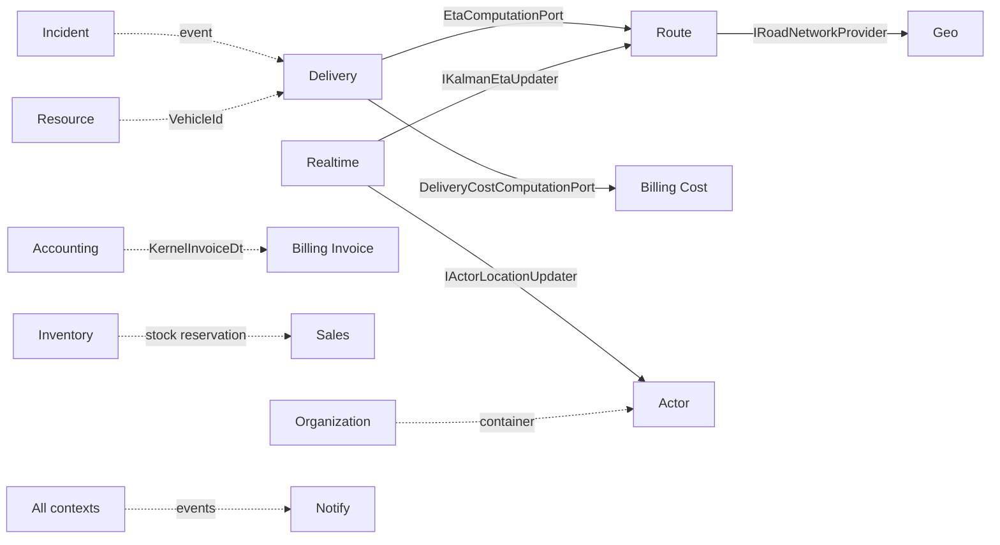

# Purpose
One-line-per-module map of bounded contexts — the DDD "what business capability does this own" view, as opposed to `architecture/modules.md`'s technical/ownership view.

# Summary
25 bounded contexts (the 6 foundation/kernel modules have no domain model of their own — they're infrastructure). Grouped by the same 4 business areas as the module layout: Identity, Logistics, Business, Billing.

# Details

## Identity
| Context | Module | Owns |
|---|---|---|
| Actor Profiles & Mission Assignment | tnt-actor-core | Deliverer/Freelancer/RelayOperator/Client profiles, KYC status, badges, ratings |
| Organizational Structures | tnt-organization-core | FreelancerOrganization, Agency, Branch, HubRelais |
| Platform Administration & Permissions | tnt-administration-core | Role/permission catalog, platform options, tenant provisioning |
| Third-Party & Loyalty | tnt-tp-core | TntClientProfile, KYC records, loyalty accounts, ratings |

## Logistics
| Context | Module | Owns |
|---|---|---|
| Delivery Lifecycle & Mission Tracking | tnt-delivery-core | Delivery (root aggregate), Parcel, DeliveryAnnouncement |
| Geolocation & Road Networks | tnt-geo-core | RoadNetwork, ServiceZonePolygon, RelayHub, PointOfInterest |
| Route Optimization & Rerouting | tnt-route-core | OptimizedRoute/Tour (VRP solution), Kalman ETA state |
| Real-time Tracking & Broadcasting | tnt-realtime-core | WebSocketSession, GeofenceZone, PresenceRecord (no persistence — Redis-backed) |
| Offline-First Sync | tnt-sync-core | SyncSession, OfflineOperation, EntityVersionRecord |
| Dispute & Evidence Management | tnt-dispute-core | Dispute (root), DisputeEvidence, DisputeComment |
| Incident Handling & Driver Replacement | tnt-incident-core | Incident (root), IncidentEscalation, IncidentBlockchainRecord |
| Media Storage & QR Codes | tnt-media-core | MediaFile, SignatureCapture (utility/adapter layer, no rich domain) |
| Notifications & Preferences | tnt-notify-core | Notification, NotificationPreference |

## Business
| Context | Module | Owns |
|---|---|---|
| Vehicles, Equipment & Maintenance | tnt-resource-core | Vehicle, FreelancerVehicle, Equipment, MaintenanceRecord |
| Products & Service Offers | tnt-product-core | Product, ProductVariant, ServiceOffer |
| Stock Management & Hub Occupancy | tnt-inventory-core | StockEntry, HubPackageEntry, InventoryMovement |
| Sales Orders & Fulfillment | tnt-sales-core | TntSalesOrder (root), TntSalesOrderLine |
| OHADA Journal & Financial Reporting | tnt-accounting-core | Account, JournalEntry, AccountingPeriod, FinancialStatement |

## Billing
| Context | Module | Owns |
|---|---|---|
| Dynamic Pricing & Promotion Rules | tnt-billing-pricing | PricingRule, BillingPolicy, Promotion, PriceEvaluation |
| Operational Cost Computation | tnt-billing-cost | CostContext, OperationalCost, FleetCostParameters |
| Billing Policy DSL & Rule Engine | tnt-billing-dsl | DslRule, AppliedRuleRecord, PricingContext |
| Invoice Generation & Payment Tracking | tnt-billing-invoice | Invoice (root), InvoiceLine, CreditNote |
| Wallet & Payment Processing | tnt-billing-wallet | Wallet (root), WalletTransaction, PaymentIntent |
| Analytics & Reporting | tnt-billing-report | Read-only CQRS projections — no domain events |
| Policy Template Management | tnt-billing-templates | PolicyTemplate, CustomPolicyTemplate |

## Bounded context relationships (high-traffic)

# Links
- `domain/aggregates.md`, `domain/entities.md`, `domain/value-objects.md`, `domain/events.md`, `domain/workflows.md`
- `architecture/dependencies.md` — technical dependency graph (vs this DDD relationship view)
- `knowledge/project-map.md` — file-level index per context

---
> **Comment maintenir ce document** : un nouveau bounded context = une nouvelle ligne ici + un nouveau module dans `architecture/modules.md`. Garder le diagramme Mermaid limité aux relations à fort trafic — pas besoin d'exhaustivité, voir `architecture/dependencies.md` pour le graphe technique complet.
