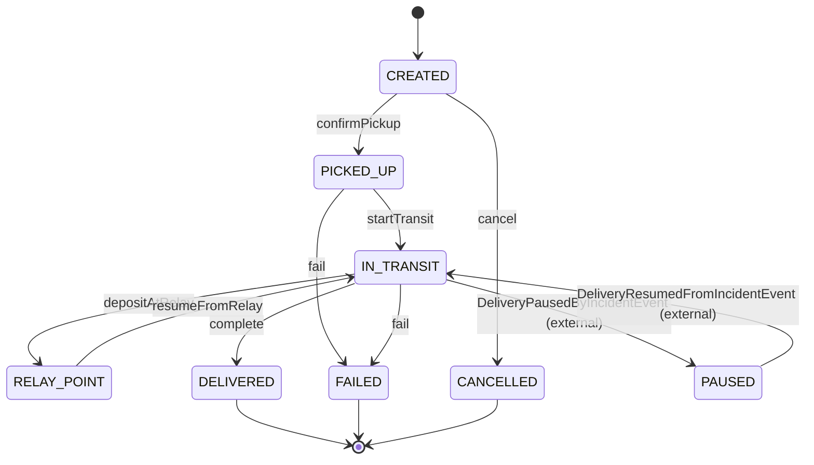
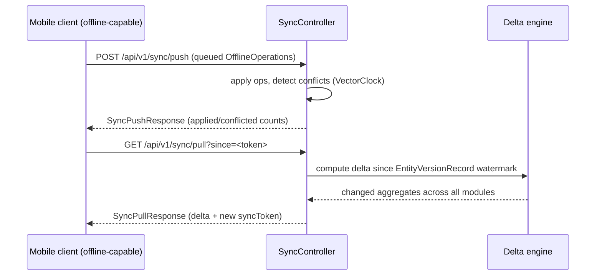

# Purpose
The key cross-cutting state machines and multi-step workflows — the "how does a delivery actually get from creation to completion" view that no single class shows you.

# Summary
6 core workflows: Delivery lifecycle, Incident handling, Dispute resolution, Offline sync (push/pull), Wallet payment, Invoice lifecycle. Each is implemented as an explicit state machine (enum + transition validation) inside the owning aggregate's domain service.

# Details

## Delivery lifecycle (tnt-delivery-core)

Driven by `DeliveryController` endpoints (`/pickup`, `/transit/start`, `/relay/{id}/deposit`, `/relay/resume`, `/complete`, `/fail`, `/cancel`) — see `api/rest.md`. Pause/resume are event-driven, not direct API calls (incident-core publishes, delivery-core listens).

## Incident lifecycle (tnt-incident-core)
```
REPORTED → TRIAGED → (AUTO_RESOLVING | AGENCY_HANDLING | ESCALATED) → RESOLVED → CLOSED
                                                                      ↘ CANCELLED
```
Entry point: `POST /api/v1/incidents` or `/driver-withdrawal`. Triage decides auto-resolution vs. agency handling vs. escalation based on `IncidentRiskScore`. Every transition is logged to `IncidentEventLog` and (for evidence-bearing transitions) chained into `IncidentBlockchainRecord` for tamper-evidence. See `security/known-issues` for the evidence-archival MinIO bucket fix.

## Dispute lifecycle (tnt-dispute-core)
```
OPENED → (MEDIATOR_ASSIGNED) → UNDER_MEDIATION → RULED → CLOSED
       ↘ ESCALATED ↗
```
Entry: `POST /api/v1/disputes`. `DisputeSLAPolicy` drives auto-escalation if a stage exceeds its SLA window (background scheduler, see `infrastructure/monitoring.md`/Spring bean inventory for the scheduler bean).

## Offline-first sync (tnt-sync-core)

First-ever sync uses `GET /api/v1/sync/bootstrap` (full snapshot, no delta). `tnt_entity_version` table (see `infrastructure/database.md`) is the single source of truth for "what changed since when" — every module's mutating use-case is expected to also write an `EntityVersionRecord` (cross-module convention, not enforced by the compiler — check this when adding new mutating endpoints).

## Wallet payment (tnt-billing-wallet)
```
PaymentIntent created → provider webhook (MTN MoMo / Orange Money / Stripe) → PaymentConfirmedEvent | PaymentFailedEvent
                                                                              → WalletCreditedEvent/WalletDebitedEvent
                                                                              → CommissionCalculatedEvent (split to FreelancerOrg sub-deliverers)
```
Idempotency enforced via Redis-backed `RedisIdempotencyStore` keyed on provider transaction ID — prevents double-crediting on webhook retries.

## Invoice lifecycle (tnt-billing-invoice)
```
DRAFT → ISSUED → PAID
              ↘ CANCELLED (DRAFT/ISSUED only)
ISSUED → credit-note issued (does not change Invoice status, creates separate CreditNote)
```
VAT computed per country at generation time (Cameroon 19.25%, Nigeria 7.5%, Kenya 16% — see `tnt.billing.templates.default-currency` and country-specific tax rule classes).

# Links
- `domain/events.md` — events fired at each transition
- `api/rest.md` — the endpoints that trigger each transition
- `infrastructure/database.md` — `tnt_entity_version` (sync watermark table)

---
> **Comment maintenir ce document** : un nouveau workflow multi-étapes (state machine, saga, ou séquence cross-module) = une nouvelle section ici avec un diagramme Mermaid. Garder chaque diagramme sous ~15 lignes — pour le détail, renvoyer vers le code.
