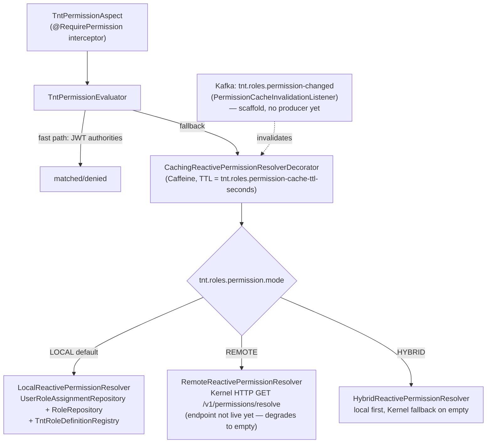

# Purpose
The pluggable permission-resolution architecture (`ReactivePermissionResolver` LOCAL/REMOTE/HYBRID) and the `TntPermission` string catalog — implemented 2026-06-29 specifically so RBAC works fully today, without waiting for the Kernel's permission-resolution REST endpoint.

# Summary
`@RequirePermission`'s public API never changes. Behind it, one of three resolver strategies is selected via `tnt.roles.permission.mode` (default `LOCAL`), wrapped in a Caffeine cache with Kafka-driven invalidation. This is ADR-004 — see `architecture/decisions.md`.

# Details

## Architecture

## Files (`foundation/tnt-roles-core/.../adapter/out/permission/`)
| Class | Role |
|---|---|
| `PermissionCache` | Caffeine wrapper, key `tenantId:userId`, TTL-based |
| `LocalReactivePermissionResolver` | Resolves from `UserRoleAssignmentRepository` → `RoleRepository` → unions with `TntRoleDefinitionRegistry` defaults by role code; applies AGENCY/ORGANIZATION scope-suffixing matching `TntPermissionEvaluator.matches()` |
| `RemoteReactivePermissionResolver` | `kernelWebClient.get().uri("/v1/permissions/resolve?userId={userId}", ...)` — graceful empty-set degradation on any error (Kernel doesn't expose this endpoint yet — returns 404, handled, NOT a bug) |
| `HybridReactivePermissionResolver` | local first, `switchIfEmpty(remote...)` |
| `CachingReactivePermissionResolverDecorator` | Wraps whichever strategy is selected, fronts it with `PermissionCache` |

Selection logic in `TntRolesAutoConfiguration.reactivePermissionResolver()` — a `switch` on `properties.getPermission().getMode()`.

`foundation/tnt-roles-core/.../adapter/in/kafka/PermissionCacheInvalidationListener.java` — `@KafkaListener(topics="tnt.roles.permission-changed")`. Payload `{"tenantId": "...", "userId": "..."}` evicts one entry; tenantId-only evicts the tenant; unparseable payload evicts everything (fail-safe). **No producer publishes to this topic anywhere in the codebase yet** — forward-compatible scaffold for when role-mutation flows (e.g. in `tnt-administration-core`) start emitting change events.

## Config (`tnt.roles.*`)
| Property | Default | Purpose |
|---|---|---|
| `tnt.roles.permission.mode` | `LOCAL` | `LOCAL`/`REMOTE`/`HYBRID` |
| `tnt.roles.permission-cache-ttl-seconds` | `300` | Caffeine TTL |
| `tnt.roles.aop-enabled` | `true` | Master switch for `TntPermissionAspect` bean registration (only `false` in test profile) |
| `tnt.roles.system-tenant-id` | `00000000-0000-0000-0000-000000000001` | Seeds global role definitions |
| `tnt.roles.provision-on-startup` | `true` | Idempotent role provisioning to Kernel at startup |

## `TntPermission` catalog
Public `String` constants in `TntPermission.java`, format `resource:action`. Categories: `MISSION_*`, `DELIVERY_*`, `BILLING_*`, `INVOICE_*`, `WALLET_*`, `AGENCY_*`, `BRANCH_*`, `ACTOR_*`, `TRUST_*`, `RELAY_*`, `ANNOUNCEMENT_*`, `DISPUTE_*`, `REPORT_*`, `RESOURCE_*`, `PRODUCT_*`, `INVENTORY_*`, `SETTINGS_*`, `ROUTE_*`, `GEO_*`, `MEDIA_*`, `PAYMENT_*`, `ADMIN_*`, plus `ALL` (`"*"`, TNT_ADMIN only). Always import the constant — never hardcode a permission string inline. See `api/security.md` for endpoint-level usage.

## Kernel role provisioning (separate from permission *resolution*)
`KernelRoleProvisioningAdapter` (`adapter/out/kernel/`) implements `ITntRoleProvisioningPort` — `POST /v1/roles` to seed the 9 canonical roles into the Kernel DB at startup. **Currently fails with `404 Not Found`** for every role — confirmed genuine Kernel-side gap (endpoint doesn't exist yet), not a code bug. Idempotent (skips on `409 CONFLICT`).

# Links
- `security/authorization.md` — how the resolver is invoked from `@RequirePermission`
- `security/roles.md` — `TntRole` enum, default permission sets per role
- `architecture/decisions.md` — ADR-004 (why this architecture exists)
- `infrastructure/kafka.md`, `infrastructure/redis.md` — invalidation topic, cache tier choice

---
> **Comment maintenir ce document** : dès que le Kernel expose `GET /v1/permissions/resolve` ou `POST /v1/roles` réellement (plus de 404), mettre à jour les notes "not live yet"/"currently fails" — et envisager de changer le mode par défaut de `LOCAL` vers `HYBRID`. Si un producteur Kafka pour `tnt.roles.permission-changed` est ajouté, retirer la mention "scaffold, no producer yet" ici ET dans `infrastructure/kafka.md`.
